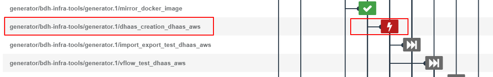
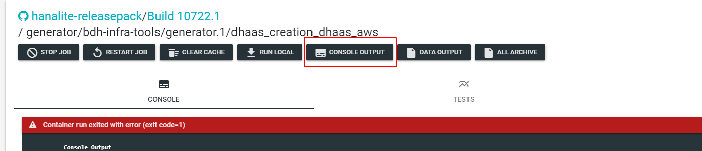
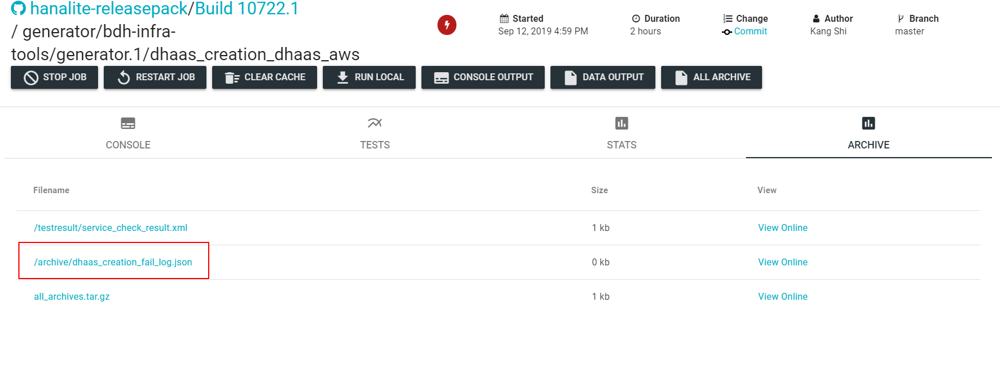

# Analyze DI Instance Creation Failure

Currently DI validation is added into push validation in stable branch, if the DI instance creation fails, it will affect following test jobs, so we need to analyze and resolve the failure issue at first time.
There are 2 steps to create a DI instance in push validation, they are: “**mirror_docker_image**” and “**dhaas_creation_dhaas_aws**”.

Function of “**mirror_docker_image**” is pull required docker image from release repository, then push them to current cloud repository. 

In job “**dhaas_creation_dhaas_aws**”, it will call IM API “api/v1/tasks/deployment” to create a DI cluster, if it fails, we can analyze this job with following steps:
## Find dhaas creation job from infrabox build
After push validation was triggered, you can find the DHAAS creation job in infrabox build list, job name is “dhaas_creation_dhaas_aws”(currently dhaas only run on aws), like:
 
## Get console output of the job
If it runs fails, you can double click of this job in the jobs list and it will jump to the job detail page, then click ‘CONSOLE OUTPUT’ button, to see the console output of the job, you can find some details of this job from console. 
  
## Get creation log if job was failed
If the DHAAS cluster creation fails, it will collect cluster log: click ‘Archive’ tab in the job page, then you will find “dhaas_creation_fail_log.json”: 

## Analyze “dhaas_creation_fail_log.json”
There are 2 kinds of log, but they are with same name, one is cluster log, which is get from CC API:
 
 > _/ui/ops/landscapes/[landscape]/regions/[regional_cluster]/clusters/[shoot_name]/logs?vflow=true&prev=true&onlyError=false&includeDescriptions=true_

Example of log get from CC API:  [dhaas_creation_fail_log.json](https://sap-my.sharepoint.com/:u:/p/kang_shi01/EYFLd21R6v9AqJ91r6O2SLcB7B5lFCahF315g4BSKImGXA?e=XShzZI)

You can find cluster detail from this log, such as: instanceId, landscapeName, provider etc. 
The other kind of log is acquired from IM API:

 > _/api/v1/tasks/deployment/[inumber]?page=1&per_page=10&kc_name=[cluster_name]_

In this situation, cluster is not created yet, cluster log can’t be get from CC API, but IM have stored some install process log, we can use it to analyze failed in which step. 

Example of log get from IM API: [dhaas_creation_fail_log.json](https://sap-my.sharepoint.com/:u:/p/kang_shi01/EdHJ0X17uCBCk7sTPIia7jIBrue_LkIHt0gZtjqf_SIXLQ?e=kjBwkH)

**Note**
> you need to format the `dhaas_creation_fail_log.json` file manually after download, otherwise, it hard to read.

## Get pods log
If some pods of DI cluster are already created, but the other are not successfully created, it will save all created pods log namely **"dhaas_pod_log.zip"** which is in the save archive list as file _"dhaas_creation_fail_log.json"_. Please uncompress  this zip file, then you can find all pods logs.
