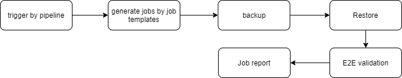
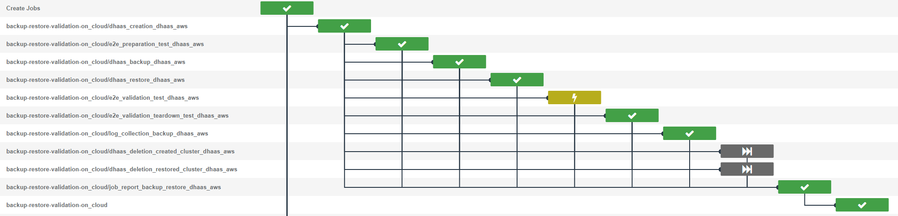
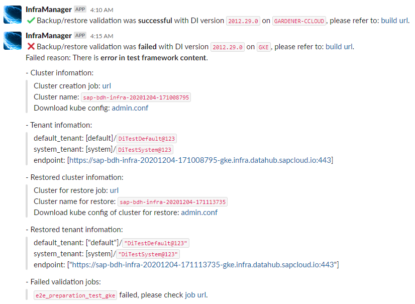

# Backup&restore Validation

Backup&restore Validation is used for testing the feature of back and restore of DI, it will performered both on cloud and on premise.

[Infrabox Project](https://infrabox.datahub.only.sap/dashboard/#/project/milestone_validation_backup)

## Overview

Platform | Backup | Trigger snapshot | Restore | E2E Test 
------------ | ------------- | ------------- | ------------- | -------------
AKS | √ | √ | √ | √
EKS | √ | √ | √ | √
GKE | √ | √ | √ | √
DHAAS | √ | × | √ | √
GARDENER-CCLOUD | √ | √ | √ | ×

## Work Flow

The following chart shows the work flow of Backup&Restore Validation.

## Trigger
- Backup&Restore Validation is triggered by [trigger job](https://infrabox.datahub.only.sap/dashboard/#/project/velocity-infra%2Ftrigger-milestone-validation).
- [trigger job](https://infrabox.datahub.only.sap/dashboard/#/project/velocity-infra%2Ftrigger-milestone-validation) is updated by [releasepack pipeline](https://gkedatahub.jaas-gcp.cloud.sap.corp/job/donut_releasepack/build?delay=0sec) automated. 
- After a new release as built, [releasepack pipeline](https://gkedatahub.jaas-gcp.cloud.sap.corp/job/donut_releasepack/build?delay=0sec) will trigger the infrabox build with 2 envs **CODELINE** and **RELEASEPACK_VERSION**

### Job template

Backup&Restore validation use 2  infrabox job templates 2 create validation jobs:
- on cloud: [job template](https://github.wdf.sap.corp/bdh/bdh-infra-tools/blob/master/hera/di_backup_milestone_test_on_cloud.json)
- on premise: [job template](https://github.wdf.sap.corp/bdh/bdh-infra-tools/blob/master/hera/di_backup_milestone_test_on_premise.json)

## Display

### Slack Channel

We send slack massages to show the result of the validation to show the result of the validation to the slack channel #di-backup-restore-validation.

Here is the channel url of slack:

https://sap-data-intelligence.slack.com/archives/C019LAT6JK0

### Dashboard

We have a dashboard of CI to display all of validations of CI including Backup&Restore Validation.

[CI Dashboard](https://dashboard.datahub.only.sap/index.jsp#home)

