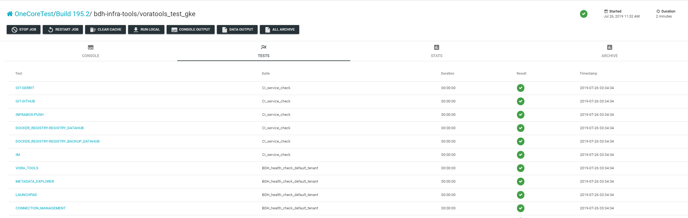

# CI Previous Check

In order to make sure the tests can be executed in the right way, we add several previous checks to the test.

## How to Display

CI Previous Check contains several check parts, and each part has its own test suites. Check items are treated as test
cases which belong to suites. We use [junit_xml](https://pypi.org/project/junit-xml/) as the tool to generate xml reports
for each part, and show the results on the page of the job on [infrabox](https://infrabox.datahub.only.sap/dashboard/#/)
dashboard website.

For an example:

## What kinds of Checks do We Have

### Service Check

Go over basic external service items before each job to guarantee that the job can run without service issue.
- Check Count : 3 times
- Each Interval : 5 minutes
- Single Wait : 1 minute

#### Check Items

Case Name | Suite | Content
------------ | ------------ | -------------
IM | CI_service_check | https://odtem-api.datahub.only.sap:443/api/v1/prechecked/result https://odtem-api.datahub.only.sap:443/api/v1/tasks/prechecked/result/global/GCP-GKE
ODTEM | CI_service_check | https://odtem-api.datahub.only.sap/api/v1
GIT-GERRIT | CI_service_check | https://git.wdf.sap.corp
GIT-GITHUB | CI_service_check | https://github.wdf.sap.corp
INFRABOX-PUSH | CI_service_check | Try to push a infrabox project with infrabox client.
DOCKER_REGISTRY-REGISTRY_DATAHUB | CI_service_check | https://di-dev-cicd-docker.int.repositories.cloud.sap/v2/_catalog
DOCKER_REGISTRY-REGISTRY_BACKUP_DATAHUB | CI_service_check | https://registry-backup.datahub.only.sap/v2/_catalog

### Health Check

Login as a real user of BDH and check the status of each component before test jobs to guarantee that BDH is available before the test.
We use two tenants to login into BDH, default tenant and system tenant.
- Check Count : 3 times
- Login Timeout : 2 minutes
- Single Wait : 1 minute

#### Check Items

Case Name | Suite | Content
------------ | ------------ | -------------
LAUNCHPAD | BDH_health_check_default_tenant | /app/datahub-app-launchpad
VORA_TOOLS | BDH_health_check_default_tenant | /app/vora-tools
PIPELINE_MODELER | BDH_health_check_default_tenant | /app/pipeline-modeler
METADATA_EXPLORER | BDH_health_check_default_tenant | /app/datahub-app-metadata/#metadata
CONNECTION_MANAGEMENT | BDH_health_check_default_tenant | /app/datahub-app-connection
KIBANA | BDH_health_check_system_tenant | /user-app/diagnostics-kibana
GRAFANA | BDH_health_check_system_tenant | /user-app/diagnostics-grafana/
LAUNCHPAD | BDH_health_check_system_tenant | /app/datahub-app-launchpad
SYSTEM_MANAGEMENT | BDH_health_check_system_tenant | /app/datahub-app-system-management

## Where do We Check and Bug Creation

### Install Job

### Component Test Job

### Other Job

