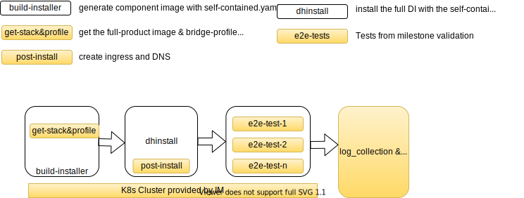

# Execute e2e validation in components repository
This document describe how to ultilize datahub-operator `test-image` base to execute the e2e tests.
## Background
In order to execute the e2e tests in component repository, which are identical as the ones in milestone validation, developer could include bdh-infra-tools into the PR validation to build the DI installer **with the changes in commit  or PR**, then install DI on GKE and kick-off the validation. However, it use `installer.sh` which is not supported by Installer Core team now and will be removed entirely in the nearly future. Installer core team provide a new way to pack the commit changes in to a configuration(`stack.yaml` + `profile`) and install/test with it:
[K8S Installation Test On Infrabox](https://github.wdf.sap.corp/pages/velocity/datahub-operator/#/pages/full-installation-test). Based on this, QIT team extend the framework to be able to execute the current e2e test jobs.


## General

- The `yellow` rectangle stands for the scripts or infrabox jobs be done by **QIT Xi'an team.**
- The `white` rectangle stands for the infrabox jobs should be done by **component developer.**
- **Installer Core** team would support component developer on `build-installer` and `dhinstall` jobs.

## Getting Start
If there is already an infrabox job to build the component image and `self-contained` stack, i.e: [build-installer in vsystem](https://github.wdf.sap.corp/velocity/vsystem/tree/master/images/com.sap.datahub.linuxx86_64/installer), then the steps in the following section would guide you to build the process. Otherwise, please reach out Installer Core team([Erkan](mailto:erkan.erol@sap.com) or [Alper](alper.ulucinar@sap.com)) to create such one.


## Set-up Process
1. Create an infrabox project binding to the component repository.
2. Create a `build-installer` job to build and push the component image. The job should use base image from `com.sap.datahub.linuxx86_64/datahub-operator-installer-base` and generate the `partial.yaml`. i.e vsystem [build-installer](https://github.wdf.sap.corp/velocity/vsystem/tree/master/images/com.sap.datahub.linuxx86_64/installer)
3. Get `full-product.yaml`, `bridge-profile.yaml` from corresponding DI release image. We created a image `di-dev-cicd-docker.int.repositories.cloud.sap/bdh-infra-tools/get-full-product-stack` to fetch them and put to `/`. Besides, it also read the components versions and set to `/env.sh`. So you could add the steps below in `build-installer` Dockerfile. i.e vsystem [Dockerfile](https://github.wdf.sap.corp/i322966/vsystem/blob/ok/replace_installer_for_tests/images/com.sap.datahub.linuxx86_64/installer/Dockerfile#L41)
    ```
    ARG DEPENDENCY_INSTALLER_BASE_VERSION=2002.0.58
    ARG installer_base=com.sap.datahub.linuxx86_64/datahub-operator-installer-base:${DEPENDENCY_INSTALLER_BASE_VERSION}
    ...

    FROM di-dev-cicd-docker.int.repositories.cloud.sap/bdh-infra-tools/get-full-product-stack:0.5 as full-product
    ADD . /component-repo
    ARG CODE_LINE=master
    ENV CODE_LINE=${CODE_LINE}
    #ARG CODE_TAG=rel/2011.17.0
    #ENV CODE_TAG=${CODE_TAG}
    ARG PRODUCT_TYPE=di-platform-full-product-bridge
    ENV PRODUCT_TYPE=${PRODUCT_TYPE}
    RUN /entrypoint.sh

    ...
    # -------------------------------------------------- Build Partial Stack  ----------------------------------------------------
    FROM docker.wdf.sap.corp:51022/${installer_base} as builder
    ...

    # Copy the full-product.yaml
    COPY --from=full-product /stack.yaml /stack/full-product.yaml

    # use dhinstaller tool to "patch" the partial.yaml over released product.yaml
    RUN ./images/com.sap.datahub.linuxx86_64/installer/build.sh

    ...

    # Copy the env.sh and brideg-profile.yaml in for the following "dhinstall" job use.
    COPY --from=full-product /env.sh /env.sh
    COPY --from=full-product /bridge-profile.yaml /bridge-profile.yaml
    ```

PS: 
a) The latest version get-full-product-stack:0.5 support to get the real image version, avoid the issue that only version is created, but the image is not generated successfully. such as: [DM01-335] (https://sapjira.wdf.sap.corp/browse/DM01-335).
b) the ARG PRODUCT_TYPE should be one of [di-platform-full-product-bridge, di-platform-product-bridge, di-platform-extended-product-bridge],  default value: di-platform-full-product-bridge  
c) the ARG CODE_TAG can be the special version image you want to use, such as: 'ARG CODE_TAG=rel/2011.17.0' for some master version, 'ARG CODE_TAG=rel/3.0.50' for some rel-3.0 version. And the ARG'CODE_TAG' has a higher priority than 'CODE_LINE'. example:
```
ARG CODE_LINE=master
ENV CODE_LINE=${CODE_LINE}
--this will use the latest version of master
```
```
ARG CODE_LINE=master
ENV CODE_LINE=${CODE_LINE}
ARG CODE_TAG=rel/2011.17.0
ENV CODE_TAG=${CODE_TAG}
--this will use the special version 2011.17.0 of master
```
```
ARG CODE_LINE=master
ENV CODE_LINE=${CODE_LINE}
ARG CODE_TAG=rel/3.0.50
ENV CODE_TAG=${CODE_TAG}
--this will use the sepcial version rel/3.0.50 of rel-3.0, not use the CODE_LINE=master.
```
And you can check tags with this command under hanalite-releasepack code:
```
git tag                 (get all tags)
git tag |grep 3.0       (get rel-3.0 tag)
```

4. Patch the `full-product.yaml` by component `partial.yaml`.
Example commands to add into [build script](https://github.wdf.sap.corp/i322966/vsystem/blob/ok/replace_installer_for_tests/images/com.sap.datahub.linuxx86_64/installer/build.sh#L118)
> ```
> dhinstaller stack component \
>    --in /stack/full-product.yaml \
>    --in /stack/partial.yaml \
>    --out /stack/patch-product.yaml
> ```
5. create a `dhinstall` infrabox job to install the full DI via dhinstaller + stack.yaml + profile.yaml. The image must based on `com.sap.datahub.linuxx86_64/datahub-operator-installer-test-base`. Example: [Dockerfile](https://github.wdf.sap.corp/i322966/vsystem/blob/ok/replace_installer_for_tests/infrabox/integration-test/Dockerfile)

   - Copy the `patch-product.yaml`, `bridge-profile.yaml` and `env.sh`:
    > ```
    > COPY --from=installer /stack/patch-product.yaml /test/stack.yaml
    > COPY --from=installer /bridge-profile.yaml /config/profiles/bridge-profile.yaml
    > COPY --from=installer /env.sh /env.sh
    > ```

    - Add the ENVs below:

> ```
Environment Option                    | Example value                                                                                         | Description
--------------------------------------|-------------------------------------------------------------------------------------------------------|----------------------------------------------------------------
STACK_YAML                            | "/test/install_stack.yml"                                                                             | Stack to be installed. MUST be the one in [Set-up Process](#Set-up-Process) step #3
CLUSTER_REGISTRY               | "eu.gcr.io/sap-p-and-i-big-data-vora/infrabox/vsystem/test-install/${INFRABOX_BUILD_NUMBER}"                                                                             | registry on GCR . DO NOT change the value
NAMESPACE                             | test-installation-${INFRABOX_BUILD_NUMBER}                                                            | target namespace on kubernetes
DEFAULT_ADMIN_USERNAME                | 'admin'                                                                                               | default user in 'default' tenant
DEFAULT_ADMIN_PASSWORD                | 'VoraVora123@'                                                                                        | default user's password in 'default' tenant
SYSTEM_PASSWORD                       | 'VoraVora123@'                                                                                        | system user's password in 'default' tenant
STEP_KUBECONFIG                       | "bdh-infra-tools"                                                                                              | MUST set to `bdh-infra-tools` to load KUBECONFIG from parent job
STEP_CLUSTER_INIT                     | true                                                                                                  | if `true`, execute dhinstaller init
STEP_INSTALL                          | true                                                                                                  | If `true`, execute installation using dhinstaller.
STEP_INSTALL_COMPONENTS               | "vsystem,auditlog,diagnostic,storage-gateway"                                                                                | Use the values in the example to install all components, and please note: vora-related component is not needed, for vora is removed in master branch [BDH-12341](https://sapjira.wdf.sap.corp/browse/BDH-12341)
STEP_INSTALL_EXTRA_ARGS               |   --custom-profile /config/profiles/bridge-profile.yaml                                 | extra arguments to pass to `dhinstaller install`. `--custom-profile ` is required and it MUST be point to the one in [Set-up Process](#Set-up-Process) step #5
STEP_TEST                             | true                                                                                                 | MUST be `true`
STEP_TEST_SCRIPT                      | /infrabox/context/infrabox/deploy-ingress-route53.sh                                                  | Script to deploy ingress and DNS. Copy the files from [bdh-infra-tools](https://github.wdf.sap.corp/bdh/bdh-infra-tools/tree/master/common/script/e2e-in-component-repo) into container.
STEP_UNINSTALL                        | false                                                                                                  | MUST be `false`.
ENV_FILE                        | "/infrabox/inputs/k8s_creation_gke/env.sh"                                                                                                  | MUST be "/infrabox/inputs/k8s_creation_gke/env.sh". `k8s_creation_gke` is the job to apply cluster from IM

> ENV STACK_YAML="/test/stack.yaml" \
>     CLUSTER_REGISTRY="eu.gcr.io/sap-p-and-i-big-data-vora/infrabox/vsystem/test-install/${INFRABOX_BUILD_NUMBER}" \
>     NAMESPACE="test-installation-${INFRABOX_BUILD_NUMBER}" \
>     SYSTEM_PASSWORD="Sapvora123@" \
>     DEFAULT_ADMIN_USERNAME='admin' \
>     DEFAULT_ADMIN_PASSWORD="Sapvora123@" \
>     STEP_KUBECONFIG="bdh-infra-tools" \
>     STEP_MIRROR_IMAGES=true \
>     STEP_MIRROR_IMAGES_SOURCE_REGISTRY=public.int.repositories.cloud.sap \
>     STEP_MIRROR_IMAGES_TARGET_REGISTRY=$CLUSTER_REGISTRY \
>     STEP_CLUSTER_INIT=true \
>     STEP_INSTALL=true \
>     STEP_INSTALL_COMPONENTS="vsystem,auditlog,diagnostic,storage-gateway" \
>     STEP_INSTALL_TIMEOUT=1800 \
>     STEP_INSTALL_EXTRA_ARGS="--custom-profile /config/profiles/bridge-profile.yaml \
>     STEP_TEST=true \
>     STEP_TEST_SCRIPT="/infrabox/context/infrabox/deploy-ingress-route53.sh" \
>     STEP_UNINSTALL=false \
>     ENV_FILE="/infrabox/inputs/k8s_creation_gke/env.sh"
> ```
Take reference: vsystem [integration-test](https://github.wdf.sap.corp/velocity/vsystem/blob/ok/replace_installer_for_tests/infrabox/integration-test/Dockerfile)

6. Add the infrabox job definition to infrabox.json as below:
    ```
     {
        "name": "k8s_creation_gke",
        "type": "docker-image",
        "timeout": 12600,
        "resources": {
            "limits": {
                "cpu": 2,
                "memory": 2048
            }
        },
        "image": "di-dev-cicd-docker.int.repositories.cloud.sap/bdh-infra-tools/k8s_creation:0.0.2",
        "command": [
            "bash",
            "-c",
            "/project/entrypoint.sh"
        ],
        "environment": {
            "SERVER_URL": "https://im-api.datahub.only.sap",
            "MAX_READY_WAIT": "3600",
            "MAX_REFUSE_WAIT": "7200",
            "PROVISION_PLATFORM": "GKE",
            "MAX_ERROR_RETRY_NUM": "4",
            "CREATE_TOTAL_TIMEOUT": "10800",
            "MAX_CREATE_RETRY_NUM": "3",
            "USE_FOR": "PUSH_VALIDATION"
        }
    },
    ```
7. Add the `dhinstall` job like below:
```
    {
    "name": "dhinstall",
    "type": "docker",
    "docker_file": "infrabox/integration-test/Dockerfile",
    "build_only": false,
    "build_context": "../..",
    "timeout": 5400,
    "depends_on": [
        "vsystem-images",
        "mirror-images",
        "binary-builder",
        "localuaa",
        "auditlog",
        "hana",
        "k8s_creation_gke"
    ],
    "resources": {
        "limits": {
        "cpu": 2,
        "memory": 8192
        }
    },
    "environment": {
        "RUN_CROSS_COMPONENT": "false",
        "ENABLE_CSI": "false",
        "ENABLE_API_GATEWAY": "false",
        "ENABLE_RESILIENT_SCHEDULER": "flase",
        "ENABLE_RESILIENT_TENANT_MANAGER": "false",
        "AFTER_CREATE_TENANT_VIA_HDILIB": "false",
        "GCR_SERVICE_ACCOUNT": {
          "$secret": "GCR_SERVICE_ACCOUNT"
        }

    }
    },
```

8. Add e2e jobs after the `dhinstall` according to the TestPlan. By default, they are the test jobs used in releasepack push validation.
Example:
```
    {
      "name": "vflow_test_gke",
      "image": "di-dev-cicd-docker.int.repositories.cloud.sap/bdh-infra-tools/bit-runtime:0.1.12",
      "environment": {
          "EXTERNAL_FLAG": " --external",
          "SKIP_TESTS": "basic.subengine basic.Kafka basic.HDFS basic.machine-learning",
          "BDH_HEALTH_CHECK_DEFAULT": "FLOWAGENT,PIPELINE_MODELER",
          "CONTINUES_INTEGRATION": "TRUE",
          "RETRY_TEST": "3",
          "COMPONENT": "VFLOW",
          "VFLOW_GRAPH_TEST": "TRUE",
          "SCENARIO_LIST": "basic",
          "COM_DOCKER_IMAGE": "docker.wdf.sap.corp:51022/com.sap.datahub.linuxx86_64/vflow-integration-test",
          "BDH_HEALTH_CHECK_SYSTEM": " ",
          "PARENT_INSTALL_JOB": "dhinstall",
          "COMPONENT_TEST_NAME": "vflow_test"
      },
      "command": [
            "bash",
            "-c",
            "/project/pre_check.sh && /docker_start.sh && /entrypoint.sh"
      ],
      "resources": {
        "limits": {
          "cpu": 2,
          "memory": 8192
        }
      },
      "security_context": {
        "privileged": true
      },
      "depends_on": [
            {
          "job": "k8s_creation_gke",
          "on": [
            "finished"
          ]
        },
                {
          "job": "dhinstall",
          "on": [
            "finished"
          ]
        }
      ],
      "timeout": 18000,
      "type": "docker-image"
    },
```
 Contact [DL DataHub QIT Xian](maileto:DL_5D3FED1D25A752027AC1DCD8@global.corp.sap) to get more e2e test definition.

9. Tear down the cluster.
```
    {
      "name": "k8s_deletion_gke",
      "image": "di-dev-cicd-docker.int.repositories.cloud.sap/bdh-infra-tools/k8s_deletion:0.0.2",
      "depends_on": [
        {
          "on": [
            "*"
          ],
          "job": "dhinstall"
        },
        {
          "on": [
            "*"
          ],
          "job": "k8s_creation_gke"
        },
        {
          "on": [
            "*"
          ],
          "job": "vflow_test_gke"
        },
        {
          "on": [
            "*"
          ],
          "job": "vora_tools_ui_e2e_test_gke"
        },
        {
          "on": [
            "*"
          ],
          "job": "vflow_flowagent_test_gke"
        },
        {
          "on": [
            "*"
          ],
          "job": "vora_license_manager_test_gke"
        },

        {
          "on": [
            "*"
          ],
          "job": "vora_dqp_test_gke"
        }
      ],
      "command": [
            "bash",
            "-c",
            "/project/entrypoint.sh"
      ],
      "environment": {
        "K8S_CREATION_JOB": "k8s_creation_gke",
        "SERVER_URL": "https://im-api.datahub.only.sap",
        "PROVISION_PLATFORM": "GKE",
        "USE_FOR": "PUSH_VALIDATION"
      },
      "timeout": 12600,
      "type": "docker-image",
      "resources": {
        "limits": {
          "cpu": 1,
          "memory": 1024
        }
      }
          }
```
10. Resulotion for some possible problems, plesae check this website:
[Resulotion_for_the_possible_problems](https://github.wdf.sap.corp/i065332/do_install_with_stack/blob/master/Resulotion_for_the_possible_problems.md)
