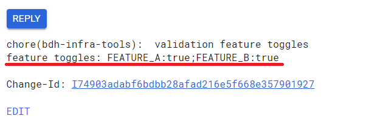
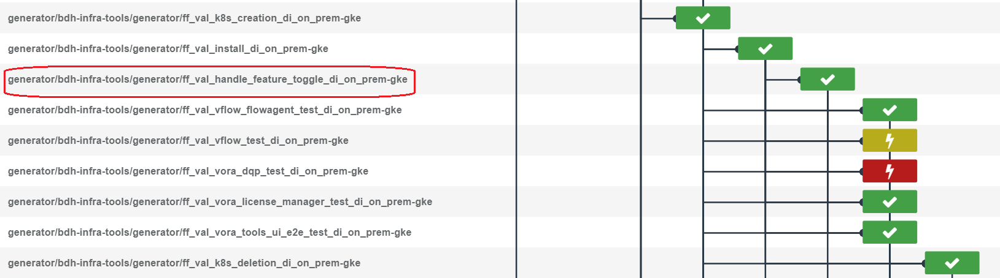

# Feature toggle validation

In order to validation certain feature toggles from DI components side, CI framework support feature toggle validation in component bubleup.  

## How to trigger a component bubleup with feature toggles
 - There is a new argument `FEATURE_TOGGLE_ARGS` was introduced in [components bubleup project](https://gkedatahub.jaas-gcp.cloud.sap.corp/job/donut_generic/)
  
 - When component trigger a pubbleup manually, and give values to this augument, feature toggle will be added with component bubleup. e.g. of value:
   ```
    --feature-toggles FEATURE_TOGGLE_A:true;FEATURE_TOGGLE_B:true
   ```
 - This argument is optional.
## Gerrit commit with feature toggle argument
When component pubbleup was triggered with feature toggle argument, there is an additinal message in related gerrit commit:
 
## Infrabox validaiton
In gerrit verify [infrabox validation](https://infrabox.datahub.only.sap/dashboard/#/project/hanalite-releasepack) jobs, there will be additinal jobs to verify feature toggle:
 
Among these jobs, `ff_val_handle_feature_toggle_di_on_prem-gke` was a new job to set feature toggle values which was input during trigger bubleup. Other validation jobs was same as common push vlaidaiton jobs.