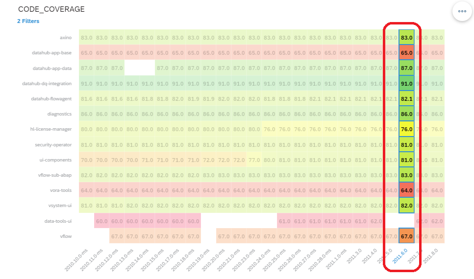
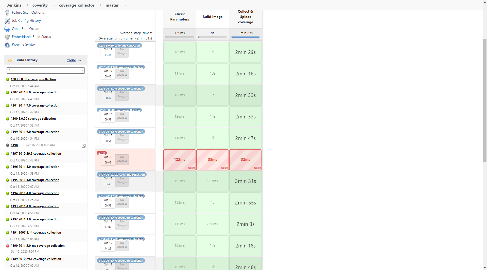
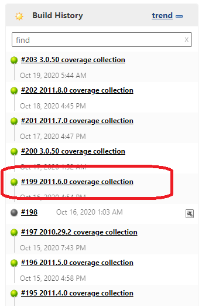
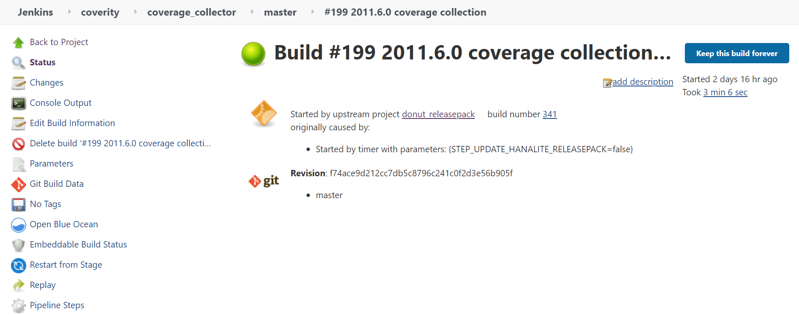
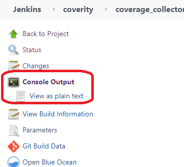
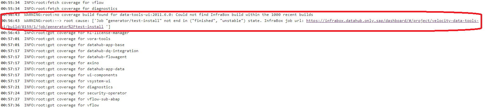

# How to find the original Code Coverage Results

If the user find that there is something missing or doubt the code coverage data correctness. 

He/She can check the original code coverage data.

Here is an example on the steps to check original code coverage data.

- In this report, there is no code coverage data for component **data-tools-ui**. Why?

- Here shows that, the component **data-tools-ui** has no code coverage data in version **2011.6.0**.

- Go to [Code Coverage Jenkins job](https://gkedatahub.jaas-gcp.cloud.sap.corp/view/coverity/job/coverage_collector/job/master/)

- Find the Jenkins build for the version **2011.6.0** from **Build History**.

- Click the build url for build detail.

- Click the **Console Output** for build log contents

|||
|---|---|
|||

- Click the url will nevigate to the component's code coverage infrabox job
