# How to find why Code Coverage result missing for a component

Sometimes, the developer find that, there are some components which has NO code coverage result in the SAC dashboard.

e.g. In this SAC dashboard, there is NO code coverage data for component **vSystem**

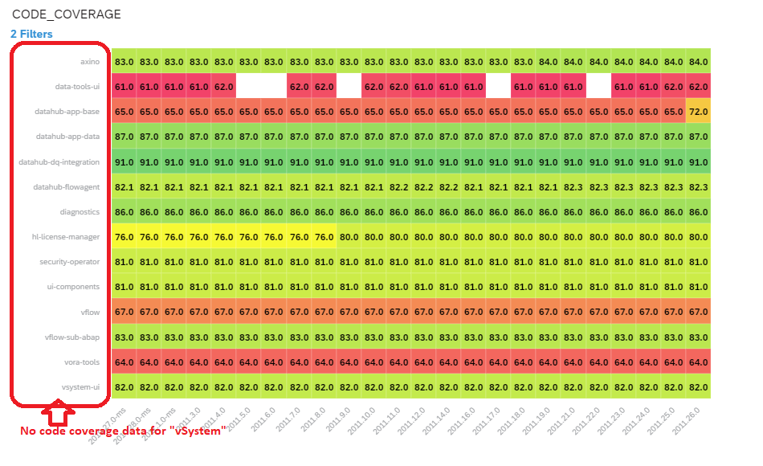

**Why ? How to check ?**

Here we use **2011.26.0** as example.

Access [Code Coverage](https://gkedatahub.jaas-gcp.cloud.sap.corp/view/coverity/job/coverage_collector/job/master/) Jenkins job

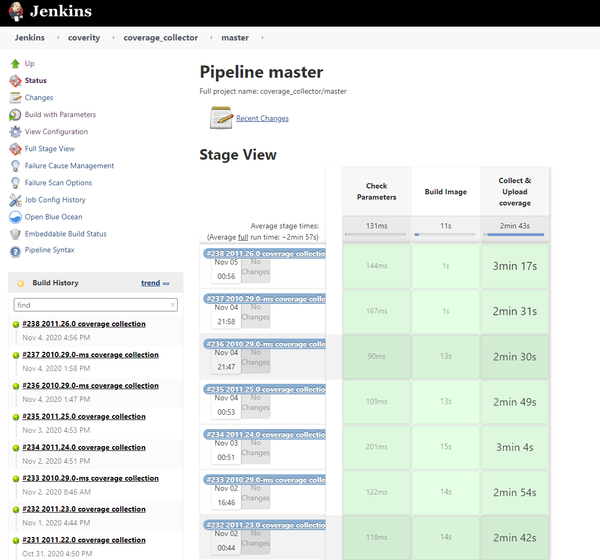

Search the build **2011.26.0** from **Build History**

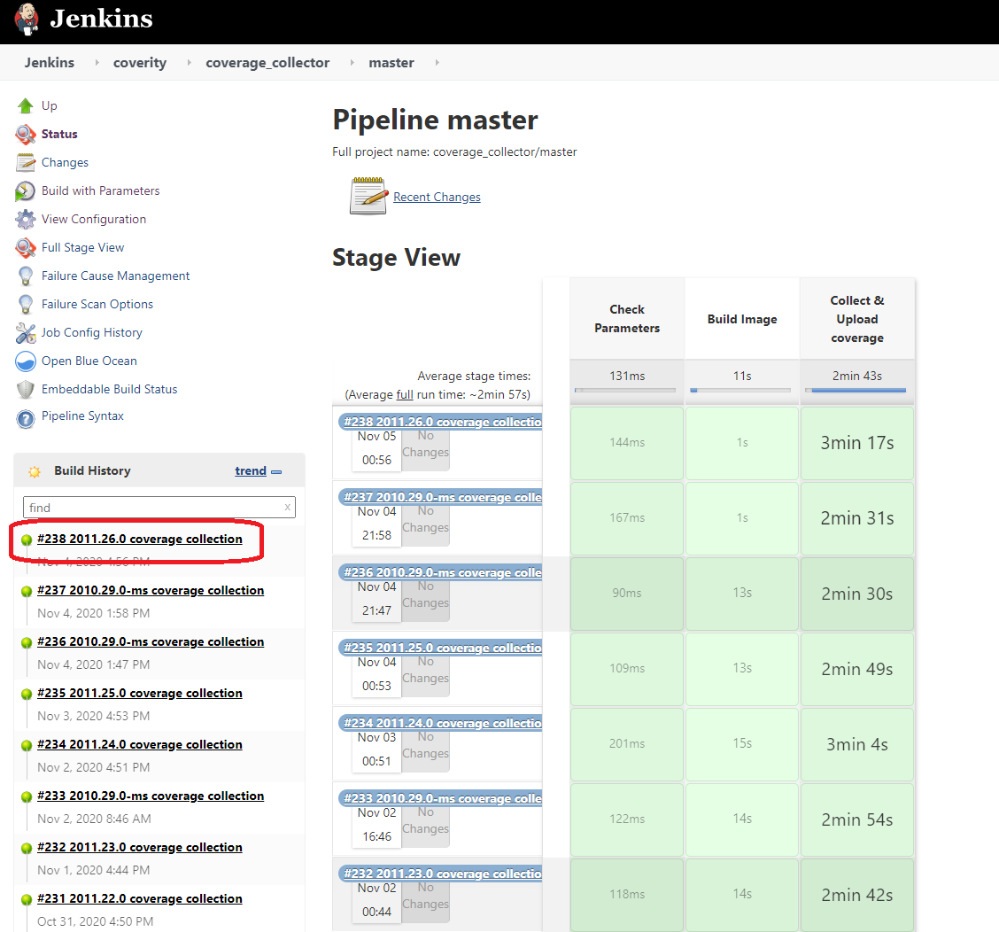

Note: 

Because of Jenkins will keep the build history log for a period of time, so you may can not find the build log too old.

Choose the build's **Console Output**

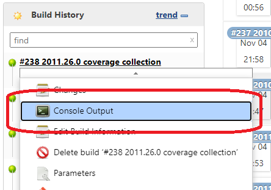

Retrieve the commit id for the component.

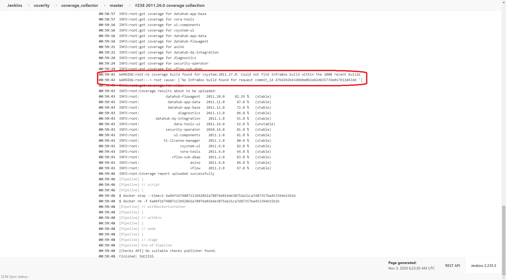

Copy the first 6 characters from commit id, e.g. **d7bd2b** 

Query the commit history for the component in GitHub

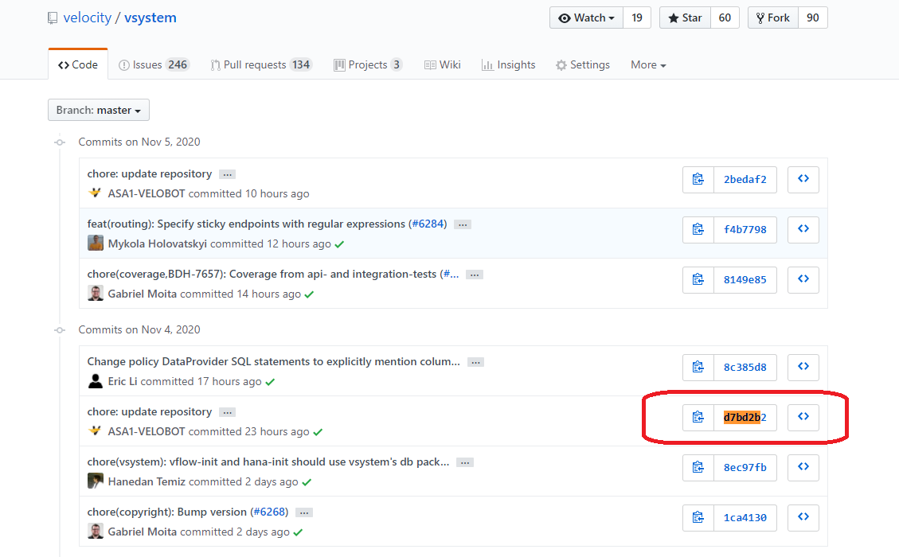

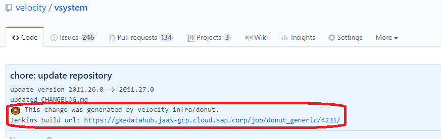

Click the Pipeline Jenkins build url, go to Pipeline Jenkins build UI

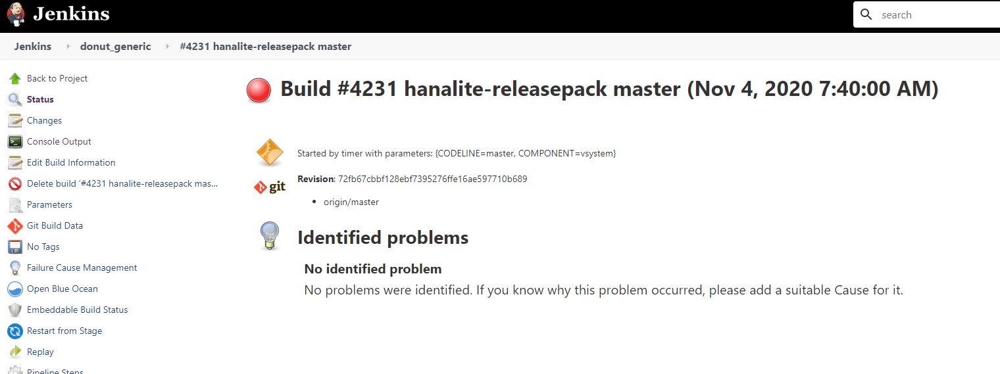

Click the **Console Output**, to find the Gerrit job url

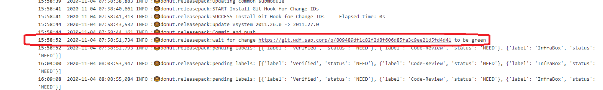

Click the link, go to Gerrit dashboard, to find the Infrabox build url

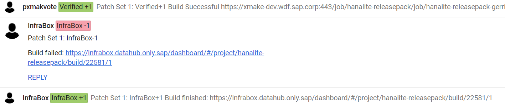

Click the link, go to Infrabox build

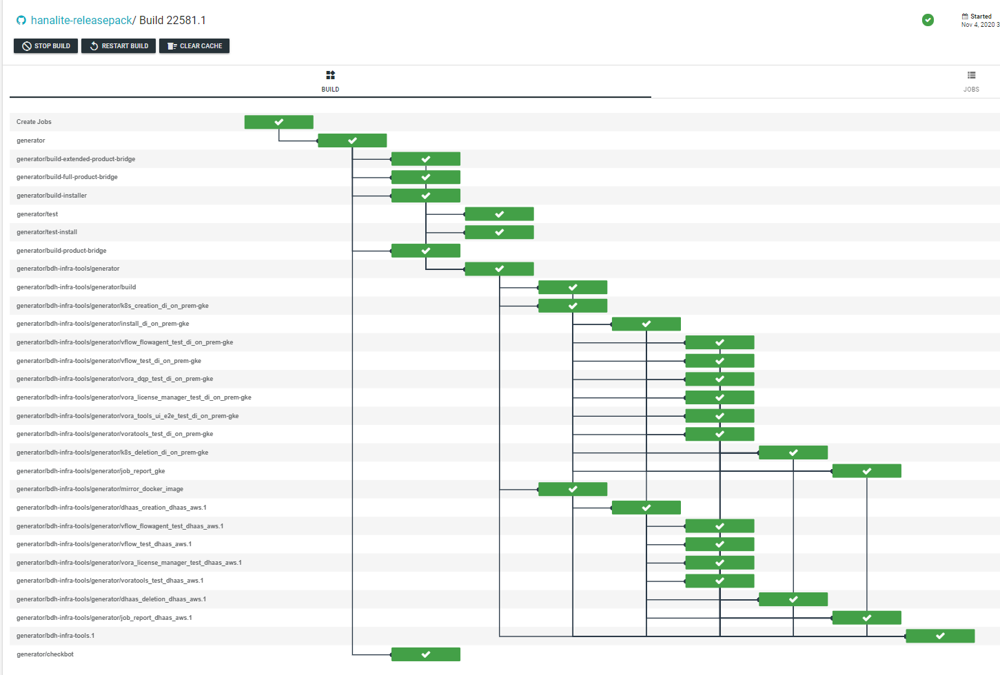

Here we want to get job **generator/coverage-aggregator** for **vSystem** to retrieve the code coverage, but does not find it.

Finally, the root cause of missing code coverage data is found.

