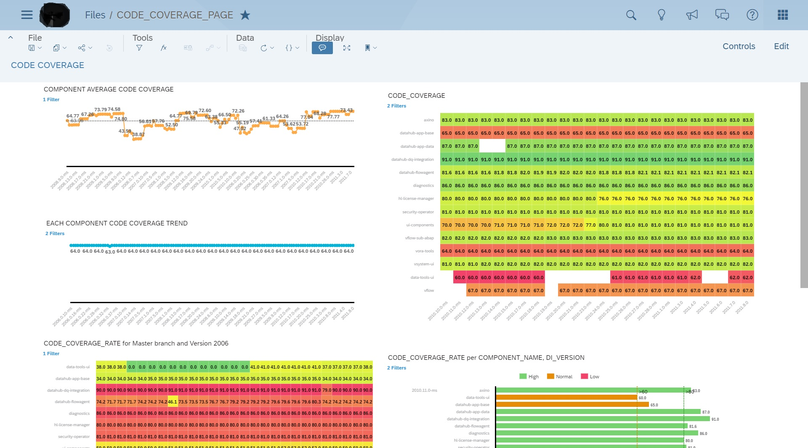

# Where to get the SAP Data Intelligence (DI) Code Coverage Report

The SAP Data Intelligence (DI) Milestone Validation code coverage report is generated by the SAP Analytics Cloud (SAC).

Access via [DI Milestone Validation Code Coverage Report](https://hanalyticsreporting.us10.sapanalytics.cloud/sap/fpa/ui/app.html#;view_id=story;storyId=9BA81AF8B2428FA6B9A094F17D3742EA;forceOpenView=true)

This is the example of the code coverage reports web page in SAC.

