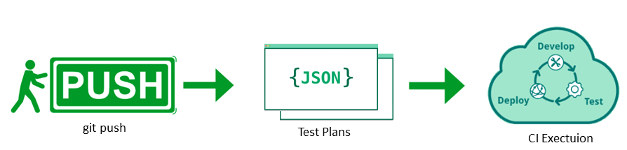
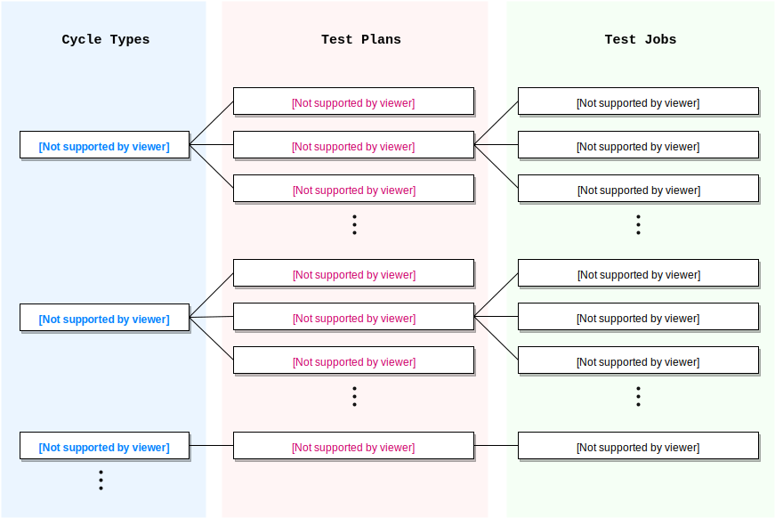

# How to Manage Test Plans

## Overview

- The CI Framework implements **Test Plan** defined in [hanalite-releasepack](https://git.wdf.sap.corp/plugins/gitiles/hanalite-releasepack/). The __ONLY WAY__  to change a test plan is to push gerrit change.
- Every **Test Plan** change is reviewed and tracked properly.



## Existing Test Plans

**Terminology in this document**
- **Test Plan**: A Test Plan is a collection of **Sub Test Plans**, which are made up of a series of **Test Jobs**, grouped by or organized in **Test Cycles**.
- **Test Cycle(s)**: A [Test Cycle](https://git.wdf.sap.corp/plugins/gitiles/hanalite-releasepack/+/master/TestCycleConfiguration/TestCycle.json) is a top level configuration which defines a group of **Sub Test Plans** that could run together.
- **Sub Test Plan(s)**: A [Sub Test Plan](https://git.wdf.sap.corp/plugins/gitiles/hanalite-releasepack/+/refs/heads/master/TestCycleConfiguration/TestPlans.json) defines a group of **Test Jobs**.
- **Test Job(s)**: A Test Job is the minimum unit for test execution, each of which runs in a single docker container with certain test suites and test cases.

The relations between the comprising parts of a Test Plan are illustrated below with examples.



|      Purpose               |      Cycle Name          |                  Triggering Condition                    |
|:---------------------------------------------:|:------------------------:|---------------------------------------------------------------------------|
|     Validate milestone release   | MILESTONE_VALIDATION     | Run milestone validation when there is a new release on [artifactory](https://int.repositories.cloud.sap/artifactory/build-milestones/com/sap/datahub/SAPDataHub/)   |
|     Validate commits in `hanalite-releasepack`       | PUSH_VALIDATION          | Run push validation when there is a gerrit change to `hanalite-releasepack` project  |
|     Validate commits in `hanalite-releasepack` with extra `hanalite_dqp` test               | PUSH_VALIDATION_update_repository     | Run push validation when there is a gerrit change with `update_repository` topic to `hanalite-releasepack` project. <br/>Command example: ```git push origin @:refs/for/master%topic=update_repository``` |
|     Validate commits in `hanalite-releasepack` with extra upgrading tests      | PUSH_VALIDATION_upgrade     | Run push validation when there is a gerrit change with a commit message containing `InfraBox: upgrade_test` to `hanalite-releasepack` project.  |
|     Validate commits in `hanalite-releasepack` with extra upgrading and `hanalite_dqp` tests                 | PUSH_VALIDATION_update_repository_upgrade     | Run push validation when there is a gerrit change with a commit message containing `InfraBox: upgrade_test` and a topic of `update_repository` to `hanalite-releasepack` project.  |
|     Validate PRs in `vsystem` repository            | VSYSTEM_VALIDATION     | Run push validation when there is PR in [vsystem repository](https://github.wdf.sap.corp/velocity/vsystem)  |
|     Validate PRs in `APP-BASE` repository               | APP_BASE_VALIDATION    | Run push validation when there is PR in [APP-BASE repository](https://github.wdf.sap.corp/bdh/datahub-app-base)  |
|      Validate PRs in `APP-BASE` repository with extra upgrading tests               | APP_BASE_VALIDATION_upgrade    | Run push validation when there is PR in [APP-BASE repository](https://github.wdf.sap.corp/bdh/datahub-app-base) with a commit message containing `InfraBox: upgrade_test` |
|     Validate PRs in `APP-DATA` repository               | APP_DATA_VALIDATION    | Run push validation when there is PR in [APP-DATA repository](https://github.wdf.sap.corp/bdh/datahub-app-data)  |
|      Validate PRs in `APP-DATA` repository with extra upgrading tests               | APP_DATA_VALIDATION_upgrade    | Run push validation when there is PR in [APP-DATA repository](https://github.wdf.sap.corp/bdh/datahub-app-data) with a commit message containing `InfraBox: upgrade_test` |
|      Validate commits in `hanlite` project           | HANALITE_LIB_PUSH_VALIDATION    | Run push validation when there is change to  [hanalite](https://git.wdf.sap.corp/plugins/gitiles/hanalite) project.|
|      Validate commits in `hanlite` project with extra upgrading tests              | HANALITE_LIB_PUSH_VALIDATION_upgrade    | Run push validation when there is change to [hanalite](https://git.wdf.sap.corp/plugins/gitiles/hanalite) project with a commit message containing `InfraBox: upgrade_test` |
|      Validate jobs unstable or new              | NIGHTLY_VALIDATION_debug    | Run on a daily basis against both master and stable branches of `hanalite-releasepack`  |

## Add or Update Test Plan
### Add or Update Test Cycle

All of the existing Sub Test Plans running in Milestone/Push/Nightly validation are controlled by [Test Cycles](https://git.wdf.sap.corp/plugins/gitiles/hanalite-releasepack/+/master/TestCycleConfiguration/TestCycle.json).

> **Anyone** who wants to add or update a Test Cycle needs to push gerrit change to [hanalite-releasepack](https://git.wdf.sap.corp/plugins/gitiles/hanalite-releasepack/) project and request **Xi'an team**([DL BDH-CI-TEST-MANAGEMENT](mailto:DL_5D312A41FFBDC902798EEC25@global.corp.sap)) for reviewing.

#### Scenarios where a Test Cycle needs to be changed

- There is a new Data Hub git repository that needs to integrate CI framework.
  > **Action**:
  > - Developers could push gerrit change to `hanalite-releasepack` to add a new one in [Test Cycles](https://git.wdf.sap.corp/plugins/gitiles/hanalite-releasepack/+/master/TestCycleConfiguration/TestCycle.json) and request **Xi'an team** ([DL BDH-CI-TEST-MANAGEMENT](mailto:DL_5D312A41FFBDC902798EEC25@global.corp.sap)) for reviewing.
  > - Please refer to [this guide](https://github.wdf.sap.corp/bdh/bdh-infra-tools/blob/add-more-odtem-doc/hera/docs/test_integration_guide/InjectYourOwnChange.md) to prepare in Data Hub git repository.

- A Sub Test Plan is ready to run in a Test Cycle
  > **Actions**: Developers could push gerrit change to `hanalite-releasepack` to update the [Test Cycles](https://git.wdf.sap.corp/plugins/gitiles/hanalite-releasepack/+/master/TestCycleConfiguration/TestCycle.json) and add the Sub Test Plan name(s) into a Test Cycle then request [Gordon](gordon.gaumnitz@sap.com) or [Tugba](tugba.bodrumlu@sap.com) for reviewing and merging.

- A Sub Test Plan is not suitable to run in a Test Cycle
  > **Actions**: Developers could push gerrit change to `hanalite-releasepack` to update the [Test Cycles](https://git.wdf.sap.corp/plugins/gitiles/hanalite-releasepack/+/master/TestCycleConfiguration/TestCycle.json) and remove a Sub Test Plan name from a Test Cycle then request [Gordon](gordon.gaumnitz@sap.com) or [Tugba](tugba.bodrumlu@sap.com) for reviewing and merging.

> For more information about Test Cycles and Sub Test Plans, please refer to [Test Cycle Management](https://git.wdf.sap.corp/plugins/gitiles/hanalite-releasepack/+/master/TestCycleConfiguration/ReadMe.md)

### Add/Update or remove Sub Test Plan

All of the existing Test Jobs running in Milestone/Push/Nightly validation are controlled by [Sub Test Plans](https://git.wdf.sap.corp/plugins/gitiles/hanalite-releasepack/+/master/TestCycleConfiguration/TestPlans.json). 

> **Anyone** who wants to add or remove a Test Job needs to push gerrit change to [hanalite-releasepack](https://git.wdf.sap.corp/plugins/gitiles/hanalite-releasepack/) project and request [Gordon](gordon.gaumnitz@sap.com) or [Tugba](tugba.bodrumlu@sap.com) for reviewing and merging.

#### Scenarios where a Sub Test Plan needs to be changed

- A Test Job running in developing nightly Sub Test Plan is ready to be promoted into milestone Sub Test Plan, e.g.: A Test Job **vflow_vloution_test** in Sub Test Plan **hanalite_releasepack_night_dev_gke** is ready to be promoted into Sub Test Plan **milestone_test_plan_gke**.
  > **Actions**: 
  > - Developers could push gerrit change to `hanalite-releasepack` to move a Test Job from one Sub Test Plan into antoher. Please refer to [Add Test Job](ResourceDoc/Test-Plan-Operations.md) for more details.
  > - In the meanwhile, **Xi'an team**([DL BDH-CI-TEST-MANAGEMENT](mailto:DL_5D312A41FFBDC902798EEC25@global.corp.sap)) monitors the Sub Test Plans in Test Cycle **NIGHTLY_VALIDATION_debug** and pushes changes to `hanalite-releasepack` for the Test Jobs that ready to run in milestone Sub Test Plans.

- Developers create a new Test Job and add it to developing or milestone Sub Test Plans.
  > **Action**: Please refer to [Register a new Test Job](ResourceDoc/Test-Plan-Operations.md) for more details.

- Developers need to update the Test Job run time enviroments. 
  > **Action**: Please refer to [Update Test Job](ResourceDoc/Test-Plan-Operations.md) for more details.

- A Test Job is not suitable for certain Sub Test Plan, developer requests remove or disable the test.
  > **Action**: Developer could push gerrit change to `hanalite-releasepack` to remove a Test Job. Please refer to [Remove Test Job](ResourceDoc/Test-Plan-Operations.md) for more details.

- A Sub Test Plan is not avaliable.
  E.g: The Gardener-AWS platform is no longer be supported. All the Sub Test Plans on that platform would be removed.
  > **Action**: Developer could push gerrit change to `hanalite-releasepack` to remove a Sub Test Plan from a Test Cycle, then remove the Sub Test Plan definition in entirely.
