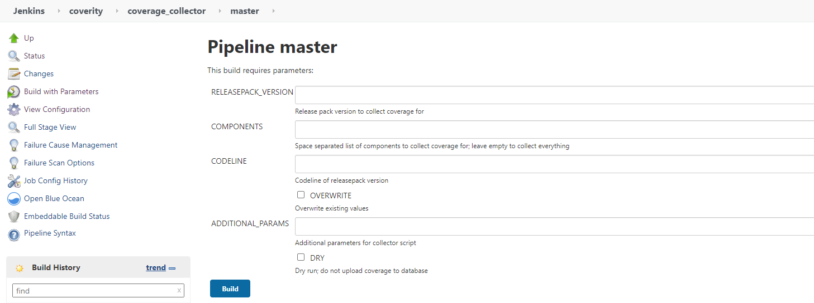

# How to generate Code Coverage Result

The DI Code Coverage result can be triggered by two ways.

## Python commands
```
$ git clone git@github.wdf.sap.corp:velocity-infra/coverage-collector.git
$ cd coverage-collector
$ python -m coverage_collector.collector -f components.json upload -l <branch> <hanalite-releasepack version>
```
## Jenkins Job
[Jenkins Job Url](https://gkedatahub.jaas-gcp.cloud.sap.corp/view/coverity/job/coverage_collector/)



- RELEASEPACK_VERSION  - hanalite-releasepack version. e.g. 2010.10.0-ms
- COMPONENTS           - components list to do code coverage. e.g. data-tools-ui, vflow, ... (blank means all components)
- CODELINE             - GitHub codeline. e.g. master
- ADDITIONAL_PARAMS    - by default leave it blank. DRY means not update SAC report

Normally the code coverage will be triggered by bubbleup pipeline with the milestone validation test daily.
