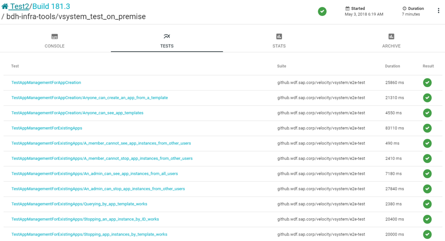
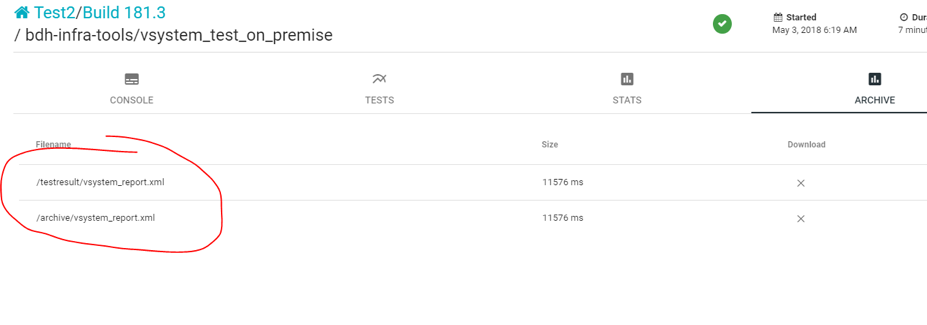

# Component test creation/integration guide

This documentation is a guide for DI/DI:E component developers who want to add integration tests into datahub validation framework. This framework is used for push validation and milestone validation for Data Intelligence（DI) and PR validation for Data Intelligence Embedded(DI:E).

The main steps:
- [Requirements for the component testing](#requirements-for-the-component-testing) 
- [Run your integration tests in a Docker Container](#run-your-integration-tests-in-a-docker-contain) 
- [Archive the test report](#archive-the-test-report) 
- [Validate the test docker image](#validate-the-test-docker-image) 
- [Deliver the Validation job](#deliver-the-validation-job) 
- [Appendix](#appendix)
## Requirements for the component testing

The test framework is designed to run all testing in docker containers in [InfraBox](https://github.com/SAP/infrabox). 
Other major automation steps are DI/DI:E package builds, k8s cluster deployment, installation, log collection and job report.

So here are the requirements for the component testing.

1. All the components testing must be configurable to run against an installed DI/DI:E.

2. Testing a single component must not affect other components.

   Bad examples are: 
   - recreate vora cluster in testing job.
   - too commonly named tables that may be used in multiple component tests.

3. All the tests have a clear test report to show the test cases/scenarios.
The [JUnit XML format](https://github.com/junit-team/junit5/blob/master/platform-tests/src/test/resources/jenkins-junit.xsd) is supported. Coverage result are also welcome, format: cobertura (xml)/ clover (xml) 

4. The test should be delivered as a docker image. See [Deliver the Validation Job](#deliver-the-validation-job)

5. Each component test should run a teardown / clean-up phase.

6. All component tests should have no direct relation to a certain cloud platform, it means they are independent from cloud platforms, and could run on all public cloud platforms. So it's better to run your test container on k8s cluster which setup in different cloud platforms. You could setup k8s cluster by [SAP Data Intelligence Infrastructure Manager](https://im.datahub.only.sap). 

7. All the tests should be able to run against different branches of DI/DI:E release, at least master branch. 

8. Carefully "exit" in your test container. Don't exit the testing with a non 0 value even if testing failed. If a test case fail, mark it as failure in the report file (see #3). 
>>  Always return *non-zero* when the container failed to trigger the test cases.

>>  Always return *non-zero* when the test case failed due to any framework issue with your experience like, 4xx/5xx connection code.

>>  Always return *zero* when the container start to run the tests, *whatever* the test case result, include pass or failed test case.

## Run your integration tests in a Docker Container

1. Make sure your tests match the [requirements](#requirements-for-the-component-testing)

2. If your test are all vflow graphs, please follow this [guide](https://github.wdf.sap.corp/velocity/vit-base-image/blob/master/README.md) to ultilize the vflow VIT base image.

3. Write a Dockerfile and execute all the testing with `docker run`. The typical docker file should contain an ENTRYPOINT bash script at the end. And put all your testing logic in this bash script.

4. Please set these env values in your bash script as your need, for a local testing. (For historic reasons the variable names contain `VORA_`, although targeting DI/DI:E.)

    ```
    export VORA_TENANT=
    export VORA_USERNAME=
    export VORA_PASSWORD=
    export VORA_SYSTEM_TENANT=
    export VORA_SYSTEM_TENANT_PASSWORD=
    export NAMESPACE=
    export VSYSTEM_ENDPOINT=

   ```
   Above are the env variables that required for local run test container, you could set this in infrabox environment or even by docker run -e option.

  - NOTE: 
     - All the testing must connect to an installed DI/DI:E. 
     - For DI full product, all tests would be executed in default tenant. If you want to execute your test in an extra tenant, please add these env values:
        ```  
        export EXTRA_TENANT_NAME=
        export EXTRA_TENANT_USER_NAME=
        export EXTRA_TENANT_USER_PASSWORD=
        ```
 
     - For DI:E, there is an important env *SERVICE_PLAN*, the one to tell which platform the test image is executing with, DI or DI:E.
        ```
        export SERVICE_PLAN='DIE_CCM' | 'DIE_DWC' | 'DIE_HC' 
        ```
        For each test job, one DI:E tenant with the corresponding strategy will be created, more details in [dis-infrastructure](https://github.wdf.sap.corp/bdh/dis-infrastructure/blob/master/deploy/helm/dis-infrastructure/values.yaml)
        ```
        DIE_DWC: dwc-tenant (default tenant)
        DIE_CCM: ccm-tenant
        DIE_HC: hana-cloud-tenant
        ```

**Full enviroments**

Name  |  Description  |  Example                                                                                                                                                                                               | 
------------ | ------------- | ------------                                                                                                                                                                                    | 
PROVISION_PLATFORM                         | The cloud/on-premise platform | 'GKE', 'AZURE-AKS', 'AWS-EKS', 'DHAAS-AWS'                                                                                             | 
KUBECONFIG                                 | The file path to the KUBECONFIG file to the cluster (The 'infrabox' folder will be mount into container ) | /infrabox/inputs/dhaas_creation_1-dhaas_aws/admin.conf                | 
VORA_VERSION / DIS_VERSION                 | The version of the DI/DIS(same as RELEASEPACK_VERSION) | 2105.0.10                                                                                                                 | 
VORA_SYSTEM_TENANT                         | The system tenant | always 'system'                                                                                                                                               | 
VORA_SYSTEM_TENANT_PASSWORD                | The password to the system tenant | random string                                                                                                                                 | 
VORA_TENANT                                | The tenant name for user tenant | 'default'                                                                                                                                       | 
VORA_USERNAME                              | The user name to logon the user tenant | 'system'                                                                                                                                 | 
VORA_PASSWORD                              | The password to the user tenant | random string                                                                                                                                   | 
VSYSTEM_ENDPOINT                           | The URL to logon the vsystem lunchpad | https://vsystem.ingress.dh-krm1xnrd.di-pushval.shoot.canary.k8s-hana.ondemand.com                                                         | 
NAMESPACE                                  | The k8s namespace that running DI/DI:E | datahub                                                                                                                                       | 
K8S_CLUSTER_NAME                           | The k8s cluster name （only for DI)| edward-wang-20191216-034143865                                                                                                                             | 
K8S_VERSION                                | The k8s version （only for DI)| 1.13                                                                                                                                                           | 
NODE_HOST                                  | (only work on GKE)The ip address of a worker node | "10.80.13.3"                                                                                                                  | 
NODE_PORT                                  | the port to log on with NODE_HOST （only for DI)| "30733"                                                                                                                                       | 
EXTRA_TENANT_NAME                          | the extra tenant, the same strategy with default tenant（only for DI)   |random string       |
EXTRA_TENANT_USER_NAME                     | the user of extra tenant （only for DI) | default value is the default tenant user  |
EXTRA_TENANT_USER_PASSWORD                 | the password of extra tenant (only for DI)     | default value is the default tenant password     |
 SERVICE_PLAN                              | create different tenant, according to this value（only for DI:E) |   'DIE_CCM' , 'DIE_DWC' or 'DIE_HC'

## Archive the test report
  
  1. Please save your test report files to `/infrabox/upload/archive` and `/infrabox/upload/testresult`.  
Then you will be able to browse and download them via infrabox job UI.
  
  2. Please set the job report in JUnit XML format, you could get a better view for each test case status from UI. 
Test result could be displayed on the job dashboard:

  
  
  Also if the report to `/infrabox/upload/archive` folder, the report could be downloaded:
  
  
## Validate the test docker image
  1. For DI full product: Please follow [this wiki](https://wiki.wdf.sap.corp/wiki/display/Odin/Test+Approval+Process), which will guide you to [the validation tool](https://dashboard.datahub.only.sap/index.jsp#/validationTool)  
  2. For DI:E: Please follow [this wiki](https://wiki.wdf.sap.corp/wiki/display/Odin/DI%3AE+Test+Approval+Process), which will guide you to [the DI:E validation tool](https://dashboard.datahub.only.sap/index.jsp#/disValidationTool)  

## Deliver the Validation job

1. Archive your test docker file in a component git repositroy.  

2. According to config.yml of each component (under config/services branch), [bubble up xmake](https://gkedatahub.jaas-gcp.cloud.sap.corp/) would build and push test docker image to docker.wdf.sap.corp registry. The image tag would be the same version along with tag of component product in git repositroy. Take CCM test Image [config.yml](https://github.wdf.sap.corp/orca/connection-service/blob/5e1c34b7d5aa8d3e692861b1fbb1a3cdfeab1d51/production-services/build-service/config.yml#L150) for example:  
 Some description of `config.yml`:
     - Templates. You could define different template with differnt build variants for different branches. In this example, `without-integration-test` is a default template.
        ```
        templates:
          - Template: master-multistage
            variants:
              - linuxx86_64
              - docker_build
              - docker_build_ci_test
          - Template: custom-packaging
            variants:
              - linuxx86_64_pkg
        ```   
    - Branch. In this example test image will be build in condition that there is master or rel-2106 branch change:
      ```
      branches:
        - Branch: master
          type: GITHUB_REL
          template: master-multistage
        - Branch: rel-2106
          type: GITHUB_REL
          template: master-multistage
        - Branch: better-sqlite-binary
          type: GITHUB_REL
          template: custom-packaging
      ``` 
      **Note**:  If there is only one template in templates, it will be the default template, and you don't need specify template in `Branch` part. It means test image will be build in every branch listed in `Branch` part.       
     - Variants. There must be serveral variants to build different target in your project, but at leaset one for test image. Please give correct args:
       ```
        - Variant: docker_build_ci_test
          runtime: docker_rhel
          args:
            - '--debug-xmake'
            - '--alternate-path'
            - 'build/ci-test'
            - '--buildplugin-option'
            - 'name=dockerbuild'
            - '--buildplugin-option'
            - 'aid=connection-service-tests-docker'
            - '--buildplugin-option'
            - 'gid=com.sap.dis.linuxx86_64'   
       ```  
   You could get contact with Xi'an team for the details.
   Docker image example:
   > docker.wdf.sap.corp:51022/com.sap.dis.linuxx86_64/connection-service-tests-docker:2106.3.0

3. Create a tickect at JIRA project [DM01](https://sapjira.wdf.sap.corp/projects/DM01/issues/DM01?filter=allopenissues), and Component/s = 'DI CI build infrastructure'. Please follow the template at this project to post your request.

## Appendix 
### How does CI/CD infrasture consume the test docker image in the DI milestone/push-validation or DI:E PR validation
The test image will be consumed in infrabox test job like this:
```
source <env.sh>
docker pull docker.wdf.sap.corp:51022/com.sap.datahub.linuxx86_64/<test-docker-iamge>:<component-version>
docker tag docker.wdf.sap.corp:51022/com.sap.datahub.linuxx86_64/<test-docker-iamge>:<component-version> di-dev-cicd-docker.int.repositories.cloud.sap/bdh-infra-tools/<test-name>:<infrabox-build-number>
docker run -v /infrabox:/infrabox -v /var/run/docker.sock:/var/run/docker.sock --privileged -e ENV_FILE=<env.sh> --env-file runtime.env di-dev-cicd-docker.int.repositories.cloud.sap/bdh-infra-tools/<test-name>:<infrabox-build-number>
```

