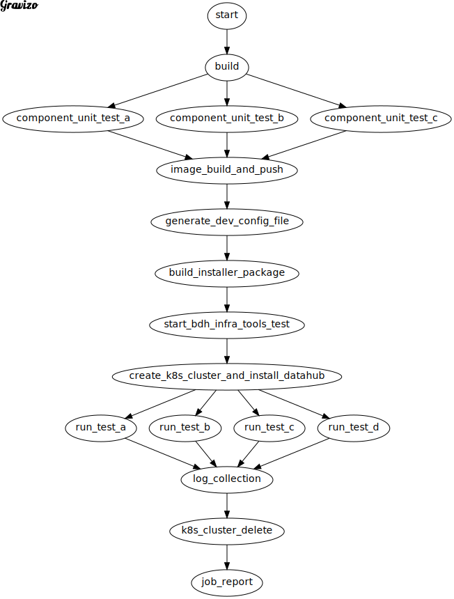
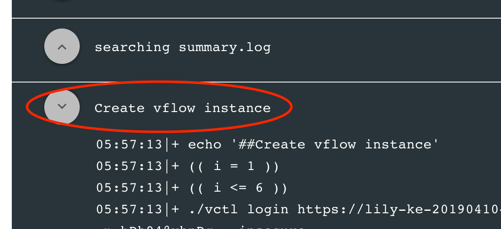
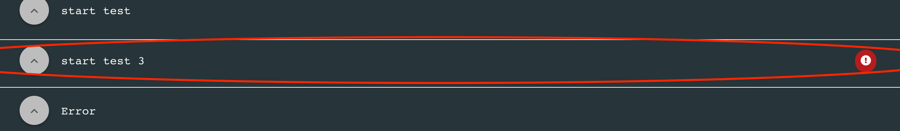

# Misc

  In this doc we will introduce some minor things about test validation framework.

## General workflow of the validation framework

Here's a graph of the workflow to show how validation framework works:



In the graph, from `start` to `generate_dev_config`, will be implemented in the component code base, then link with  `bdh-infra-tools` project by the dynamic git infrabox workflow generation code, which will also be put in the component code base. Here's an example which can be reused in your local component:

[https://github.wdf.sap.corp/velocity/vsystem/tree/master/infrabox/test-datahub-on-gke](https://github.wdf.sap.corp/velocity/vsystem/tree/master/infrabox/test-datahub-on-gke)

Component test integration developer can reuse most of the code, change the dev_config file content generation logic, and `CURRENT_COMPONENT`, `ELVIS_ARG_COMPONENTS`, `TEST_CYCLE` to start your own component integration test.

Also if you have more questions when doing the integrating, you can just contact Datahub Xi'an infrasturcture team member: [max.zhang@sap.com](mailto:max.zhang@sap.com), [edward.wang@sap.com](mailto:edward.wang@sap.com), [jing.li08@sap.com](mailto:jing.li08@sap.com).

## InfraBox log written tips

### Log section in infrabox

When dumping logs in infrabox build, if your log starts with `##`, it will create a new log section in infrabox job detail web page. Like:

```
echo '##Create vflow instance'
```

The new section will be shown as:

 

### Log badge support

There's another special infrabox syntax with `###`, which will create an error badge:

```
"### [level=error] test job failed"
```

 
