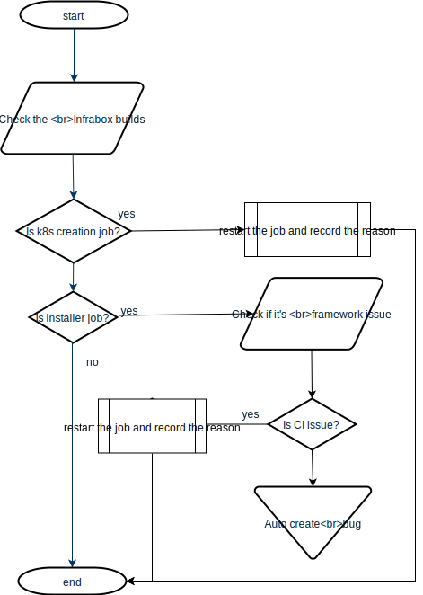

# CI Developer

## Working time duty(Mon-Fri)
### Milestone and Developing nightly validation
1. Xi'an team will check the milestone validation jobs that are not included in the daily mail report from the [Infrabox dashboard](https://infrabox.datahub.only.sap/dashboard/#/project/milestone_validation).
   - If there is any failed jobs named `k8s_creation*`, restart the job and mark the restart reason by [API](#API)
   - If there is any failed jobs named `install*`, check the error message. 
   - If there are obvious logs denoting issues related to network, DNS or others non-production, restart the job and mark the restart reason by [API](#API)
   - If none of the above, a bug will be automatically created along with the daily mail report.
  
  > 
   
2. Xi'an team will also monitor the [Job Trend](https://dashboard.datahub.only.sap/index.jsp#/validationTestTrendbyJob?version=*.0.*&deployType=on_premise).
    - If the test count or case failure rate drops dramatically, Xi'an team will analize the root cause. If it's a production issue, developers need to take care of the related bugs. 
    - If there is any critical issues related to CI, the infrabox build would be restarted with the restart reason marked by [API](#API)

### Push Validation
1. Xi'an team will monitor the `# dh-push-validation` for any blocking issues.
2. If the duration of any infrabox build lasts too long, Xi'an team will get the warning mail notification and fix it ASAP.

## Weekend (Sat-Sun)
1. On the weekend, the colleague from Xi'an team who is on-call of Level1 DevOps should monitor the milestone validation results from [Job Trend](https://dashboard.datahub.only.sap/index.jsp#/validationTestTrendbyJob?version=*.0.*&deployType=on_premise) and post the issues in Slack channel.
2. If there is any blocking issue posted by developers in the `# dh-push-validation`, the person also needs to deliver the message to [DL BDH-CI-TEST-MANAGEMENT](mailto:DL_5D312A41FFBDC902798EEC25@global.corp.sap)).
3. The [DL BDH-CI-TEST-MANAGEMENT](mailto:DL_5D312A41FFBDC902798EEC25@global.corp.sap)) should take futher actions the same as the steps during Working Time. If there is any issue that cannot be handled during the weekend, just add a warning message in the daily report.

### API
```
HSOT https://api.dashboard.datahub.only.sap:30711
POST /api/v1/trd/build/durationSummary
{
    "environment": {
        "BUILD_ID":"{build id,mandatory;eg:453.1}",
        "GERRIT_PROJECT": "{project name,mandatory; eg: hanalite-releasepack}",
        "VORA_VERSION": "{vora version, mandatory for milestone; eg:2.6}",
        "GERRIT_CHANGE_BRANCH": "{branch name, mandatory for push ; eg: stable}",
        "USE_FOR": "{validation type, mandatory;support value: MILESTONE_VALIDATION/PUSH_VALIDATION/NIGHTLY_VALIDATION_update/NIGHTLY_VALIDATION_debug}"
    },
    "build_duration_summary": {
        "retry_reason": "{milestone validation retry reason;mandatory for milestone validation. eg: power cut}",
        "base_time": "{push validation base time;mandatory for push validation, eg: YYYY-mm-dd HH:MM:SS}",
        "actual_time": "{push validation actual time;mandatory for push validation eg:YYYY-mm-dd HH:MM:SS}"
    }
}
```

