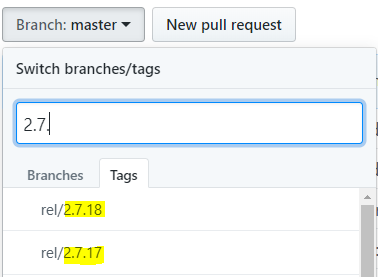

# Run CI Tests Locally

In order to run the test locally, you need to follow these steps generally:

- [Find out the docker image](#find-out-the-docker-image)
- [Prepare the Environment for Testing](#prepare-the-environment-for-testing)
  - [Directory Structure](#directory-structure)
  - [Required Files](#required-files)
    - [env.sh](#envsh)
    - [KUBECONFIG](#kubeconfig)
- [Run the Test in Docker Container](#run-the-test-in-docker-container)
- [FAQ](#faq)

## Find out the docker image
1. The test job docker image would be like: *repository:< component_version>*
2. You could find the *component_version* from the component's repository. 
   > 
3. Here is the table for the supported test job.

Test Job name | Test Job image | Component
------------  | -------------  | ---------
hanalite_dqp_test    | docker.wdf.sap.corp:51055/com.sap.datahub.linuxx86_64/vora-dqp-test-framework | HANALITE_LIB
license_manager_test |  public.int.repositories.cloud.sap/com.sap.datahub.linuxx86_64/test-vora-license-manager | LICENSE_MANAGER
vflow_datahub_dq_integration_test | docker.wdf.sap.corp:51022/com.sap.datahub.linuxx86_64/dq-integration-vflow-integration-test | DQ_INTEGRATION
vflow_flowagent_test | docker.wdf.sap.corp:51022/com.sap.datahub.linuxx86_64/flowagent-e2e-test | FLOWAGENT
vflow_test            | docker.wdf.sap.corp:51022/com.sap.datahub.linuxx86_64/vflow-integration-test | VFLOW
vflow_advanced_test   | docker.wdf.sap.corp:51022/com.sap.datahub.linuxx86_64/vflow-integration-test | VFLOW
vsystem_api_test      | docker.wdf.sap.corp:51022/com.sap.datahub.linuxx86_64/vsystem-tests-docker   | VSYSTEM

## Prepare the Environment for Testing

The environment mainly concerns a directory structure you need to bind mount to your Docker container, including several necessary files.  

### Directory Structure
The directory structure after running the test is illustrated below:
```
infrabox/
├── inputs
│   ├── install
│   │   ├── env.sh
│   │   └── vctl
│   └── k8s_creation
│       └── admin.conf
├── output
│   ├── env.sh
│   └── execution_log
└── upload
    ├── archive
    │   └── error_msg.log
    └── testresult
        ├── health_check_result.xml
        ├── integration_report_2019-08-02T05:44:35.682953.xml
        └── service_check_result.xml
```

However, for the test to successfully start, you will need to make sure the following DIRECTORIES exist as follows:
```
infrabox/
├── inputs
│   ├── install
│   │   ├── env.sh
│   └── k8s_creation
├── output
└── upload
    ├── archive
    └── testresult
```

For example, run the following commands to create this structure:
```
mkdir -p /infrabox/inputs/install
mkdir -p /infrabox/inputs/k8s_creation
mkdir -p /infrabox/output
mkdir -p /infrabox/upload/archive
mkdir -p /infrabox/upload/testresult
```

### Required Files
There are 2 files to be put in place before the test can execute:
```
infrabox/
└── inputs
    ├── install
    │   ├── env.sh
    └── k8s_creation
        └──  admin.conf
```

#### env.sh
You can find an example of `env.sh` in the `install` job from an existing CI builds by its type and platform.  
For instance, if you are to run *vflow* tests on `EKS` for *Milestone Validation*, just open any recent [milestone validation](https://infrabox.datahub.only.sap/dashboard/#/project/milestone-validation) build and find `install_eks` job, click on it, then navigate to `ARCHIVE` page located in the top section, that's where you could find the file `/archive/env.sh` and view it online.

An example of it looks like:
```
export VORA_TENANT="default"
export VORA_USERNAME="system"
export VORA_SYSTEM_TENANT_PASSWORD="bDh06@pMBzY"
export VORA_PASSWORD="bDh38@sdpso"
export PROVISION_PLATFORM="AWS-EKS"
export NODE_HOST="ethan-guo-20190729-235230686-eks.infra.datahub.sapcloud.io"
export VSYSTEM_PORT="443"
export VSYSTEM_ENDPOINT="https://ethan-guo-20190802-002815815-eks.infra.datahub.sapcloud.io"
export NAMESPACE="bdh-2-7-35-ms"
export KUBECONFIG="/infrabox/inputs/k8s_creation/admin.conf"
export K8S_VERSION="1.10"
export K8S_CLUSTER_NAME="ethan-guo-20190802-002815815-bdh-2-7-35-ms"
export VORA_MILESTONE_PATH=https://int.repositories.cloud.sap/artifactory/build-milestones/com/sap/datahub/SAPDataHub/2.7.35-ms/SAPDataHub-2.7.35-ms-Foundation.tar.gz
export ALL_COMPONENTS_VERSIONS='{"hl-vsystem-ui": "2.7.17", "security-operator": "2.7.11", "sapjvm": "81.34.34", "datahub-flowagent": "2.7.37", "dsp-release": "2.7.31", "hl-data-tools-ui": "2.7.37", "storagegateway": "2.7.17", "consul": "0.9.0-sap25", "hl-vora-tools": "2.7.6", "hl-vsystem": "2.7.52", "hl-vsolution": "2.7.23", "hl-spark-datasources": "2.7.15", "hl-hana-replication": "0.0.78", "hl-lib": "2.7.51", "docker-base": "15.0-sap24", "hl-ui-components": "2.7.31", "datahub-license-manager": "2.7.9", "datahub-app-base": "2.7.49"}'
export VSYSTEM_VERSION=2.7.52
export APP_BASE_VERSION=2.7.49
export FLOWAGENT_VERSION=2.7.37
export LICENSE_MANAGER_VERSION=2.7.9
export HANALITE_LIB_VERSION=2.7.51
export SECURITY_OPERATOR_VERSION=2.7.11
export SAPJVM_VERSION=81.34.34
export DATA_TOOLS_UI_VERSION=2.7.37
export SPARK_DATASOURCES_VERSION=2.7.15
export VSYSTEM_UI_VERSION=2.7.17
export UI_COMPONENTS_VERSION=2.7.31
export VORA_TOOLS_VERSION=2.7.6
export CONSUL_VERSION=0.9.0-sap25
export HANA_REPLICATION_VERSION=0.0.78
export DSP_RELEASE_VERSION=2.7.31
export DQ_INTEGRATION_VERSION=2.7.6
export VFLOW_SUB_ABAP_VERSION=
export VFLOW_VERSION=2.7.1
export VSOLUTION_VERSION=2.7.10
```

Terminology:
- **VORA_TENANT** The tenant name, e.g: default.
- **VORA_USERNAME** The logon user name for `VORA_TENANT` tenant.
- **VORA_PASSWORD** The logon password for `VORA_USERNAME`.
- **VORA_SYSTEM_TENANT_PASSWORD** The password to logon the `system` tenanat.(The user name for system tenant is `system`)-
- **VSYSTEM_ENDPOINT** The endpoint URL to logon the DH.
- **VSYSTEM_PORT** The port number for **VSYSTEM_ENDPOINT** URL. Normally it is `443`.
- **KUBECONFIG** The path on host point to the KUBECONFIG file.
- **NAMESPACE** The DH namespace on k8s cluster.

Naturally and crucially, you still need to change most of the values to your own needs, including *Data Hub* connection information and all kinds of component versions. Depends on your tests, it's not necessary to include all components version, just the component version you test against.

For example, to find the `VSOLUTION_VERSION` corresponding to your `<DATAHUB_VERSION>`, you will need to go to [hanalite-releasepack](https://git.wdf.sap.corp/plugins/gitiles/hanalite-releasepack/) and find the `tag` of your `<DATAHUB_VERSION>`, go into it and open up `pom.xml`, and search for `vsolution.version`. It resembles something like:
```
<hldep.hl-vsolution.version>2.7.10</hldep.hl-vsolution.version>
```

For another example, in order to find the `VFLOW_VERSION` corresponding to the `VSOLUTION_VERSION` you just looked up, you will need to go to the [vsolution](https://github.wdf.sap.corp/velocity/vsolution/) GitHub repository and find the `tag` of your `VSOLUTION_VERSION`, go into `deps` folder and location `vflow.dep`.

#### KUBECONFIG
This is the `KUBECONFIG` file of your `Data Hub` installation. The path to this file is define in `env.sh` with env name `KUBECONFIG`.

## Run the Test in Docker Container
After you've set up your environment, including the *infrabox/* directory structure and all the necessary files, you are almost ready to run your test in a container.  
Before actually running the container, you have to supply a few environment variables, either through `--env-file` or `-e`.  
**Please notice: In your test image, `source ${ENV_FILE}` need to be added, thus the installed DI can be accessed**  

The final step would be running the container with the following command:
```
# docker run -v /infrabox:/infrabox --privileged -e ENV_FILE=/infrabox/inputs/install/env.sh docker.wdf.sap.corp:51022/com.sap.datahub.linuxx86_64/vflow-integration-test:2.7.17
```

Extra option for vsystem tests:
- Get the docker registry address. If you apply the DI cluster via IM on GKE, then it probely list in the mail that you get informed when cluster set-up completed. `gcloud container registry address: eu.gcr.io/sap-p-and-i-big-data-vora/<cluster name> `
- Set the registry to key `DOCKER_REGISTRY` and add into `env.sh`
- Contact [QIT Team](mailto:DL_5D3FED1D25A752027AC1DCD8@global.corp.sap) for the logon credential
- logon the docker registry.
- Add the flag below to mount the local docker.sock into container.
```
-v /var/run/docker.sock:/var/run/docker.sock
```

Again, change any argument to yours, such as directory path, image name, and supplying additional environment variables. Be aware of the `--privileged` flag since you are running docker in docker.  
If you'd like to store the logs to a local file, you can use:
```
# docker run -v /infrabox:/infrabox --privileged -e ENV_FILE=/infrabox/inputs/install/env.sh docker.wdf.sap.corp:51022/com.sap.datahub.linuxx86_64/vflow-integration-test:2.7.17 2>&1 | tee vflow_test_eks.log
```

## FAQ
1. I encountered `error creating aufs mount to /var/lib/docker/aufs/mnt/ccc81e8c41476a5f72ea23ffc7222ba9b65c47b032a389db9acec26730d1a114-init: invalid argument`, what gives?
  > In short, newer Docker versions don't support aufs over aufs (aufs inside your docker over aufs used to create the container). You will have to use old Docker versions (not docker-ce), like 1.13.  
  > Refer to [this link](https://teamcity-support.jetbrains.com/hc/en-us/community/posts/115000757984-Team-City-Linux-Agent-Docker-Build-Failing-Docker-in-Docker-error-creating-aufs-mount-to-var-lib-docker-aufs-mnt-init-invalid-argument) for more detailed discussions.
