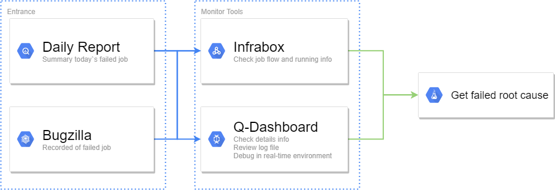
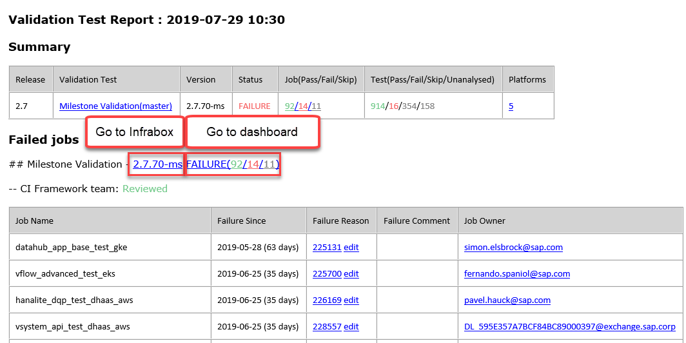
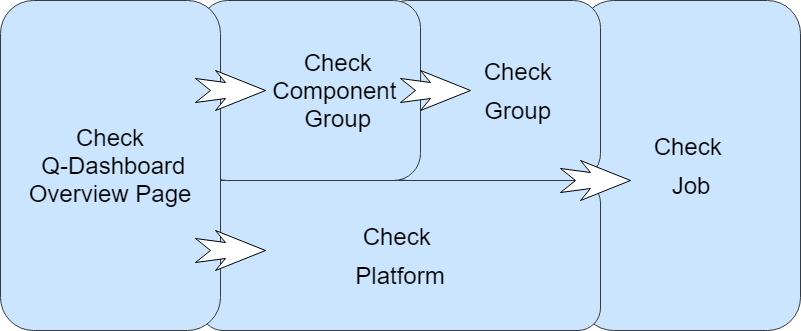
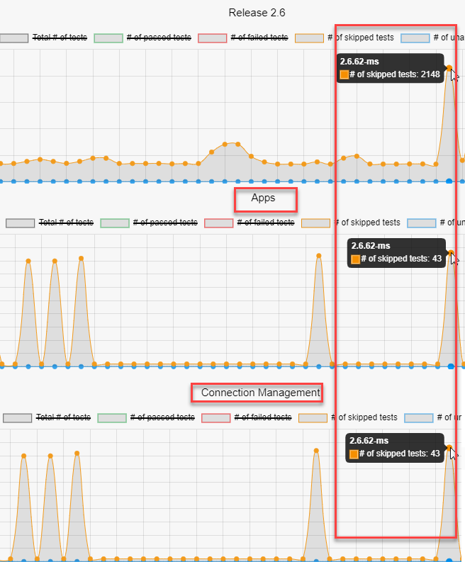

# Test-Monitoring-and-Analysis-Guideline

The main purpose of this article is to provide a standard process that allows different users to monitor and analyze test results in an efficient way.

You might be one of:

1. [[Component developer |Test-Monitoring-and-Analysis-Guideline#component-developer]]
2. [[QA manager |Test-Monitoring-and-Analysis-Guideline#qa-manager]]

Please use this guideline according to your own roles.

Goto - [SAP Data Hub Validation Dashboard](https://dashboard.datahub.only.sap/index.jsp#home)

## Component developer
For component developer, here is a brief process flowchart which can help you locate problems more quickly.

Generally, component developer uses daily report or validation dashboard for monitoring the quality of test jobs.

### 1. Daily Report for Component User

In each daily report E-mail, CI framework generates links to Infrabox and Q-dashboard. Component developer only need to click on release number to direct to Infrabox, or click on job summary to navigate to Q-dashboard page.

### 2. Validation Dashboard

In validation dashboard, there is far more we could do.
First of all, validation dashboard provides hierarchical management for test cases.
Secondly, it offer the summary statistic in test case level, and saving log files on it`s own cloud file system since log in Infrabox could only exists in few days. And it also offering a entry to help user to recreate the runtime environment.

## QA manager

By following the above flow chart. QA manger could use overview page to check the trend of total/failure test cases.
If the quantity of test case in one release increased/decreased dramatically, the changing reason could be located by checking the platform and component group statistics.
There might be two situations.
1. Platform issue: 
The changing amount might mainly occurs only in one specific platform. Therefore, QA manager could go to platform page and check the statistics. Once the abnormal platform is found, the unusual job will also be located by following the clue.
2. Component Group issue:
Same as checking platform issue, by using the component group page, component page and job page, the irregular job will also be found if user could following this flow.

Here is an example:
Compared release 2.6.62-ms with 2.6.61-ms in milestone validation, the quantity of skipped test cases increased sharply.
Under this circumstance, QA manger could check the platform trend ([Q-dashboard Milestone platform Trend page](https://dashboard.datahub.only.sap/index.jsp#/validationTestTrendbyplatform?version=*.0.*&deployType=on_premise)) and component group trend page ([Q-dashboard Milestone Component Group Trend page](https://dashboard.datahub.only.sap/index.jsp#/validationTestTrendbycomponentgroup?version=*.0.*&deployType=on_premise)) to find out why the number changed so dramatically.
In this example, component group "Apps", component "Connection Management" is the reason. Therefore, user could focus on, and have a further analysis.

