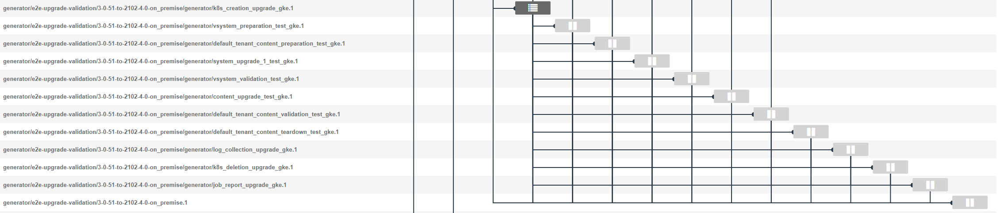
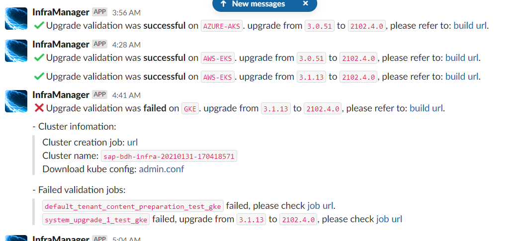

# Upgrade Validation

Upgrade Validation is used for testing upgrading DI from the base version to the target version.

[Infrabox Project](https://infrabox.datahub.only.sap/dashboard/#/project/upgrade-validation)

## Overview

Platform | System Upgrade Test | Content Upgrade Test | K8s Upgrade Test | E2E Test 
------------ | ------------- | ------------- | ------------- | -------------
AKS | √ | √ | × | ×
EKS | √ | √ | √ | ×
GKE | √ | √ | × | √
DHAAS | √ | √ | × | ×

## Work Flow

The following chart shows the work flow of Upgrade Validation.



## Trigger

Upgrade validaiton was triggered by [releasepack pipeline](https://gkedatahub.jaas-gcp.cloud.sap.corp/job/donut_releasepack/build?delay=0sec), after a new release as built, [releasepack pipeline](https://gkedatahub.jaas-gcp.cloud.sap.corp/job/donut_releasepack/build?delay=0sec) will update the releasepack version at the [deps](https://github.wdf.sap.corp/bdh/upgrade-validation/blob/master/deps/hanalite-releasepack.dep#L2) in repository [upgrade validation](https://github.wdf.sap.corp/bdh/upgrade-validation).

### Base Version & Target Version

- Once a release version of hanalite-releasepack is created, the trigger job will get it as **the target version** of Upgrade Validation.
- **Base version** of DI is from the file [upgrade_multi_base_version.json](https://github.wdf.sap.corp/bdh/upgrade-validation/blob/master/deps/upgrade_multi_base_version.json) in repository [upgrade validation](https://github.wdf.sap.corp/bdh/upgrade-validation).
An example of base version file:
```
{
    "BASE_BDH_VERSION": [
        {
            "comment": "Last DI Cloud version",
            "di-validation": "yes",
            "version": "2010.29.9"
        },
        {
            "comment": "On Premise 3.0 Patch 6",
            "di-validation": "no",
            "version": "3.0.51"
        },
        {
            "comment": "On Premise 3.1",
            "di-validation": "no",
            "version": "3.1.13"
        }
    ]
}
```
    - Every branch has it's only base version file.
    - Every item in this file will be a base version entry.
    - di-validation: on cloud or on premise validation. This value was set to **yes**, it means, this validaiton was run on cloud release, otherwith, it will run on premise.
    - version: The concreate base version that upgrade from.

### How to use upgrade_multi_base_version.json<span id="jump"></span>
Once upgrade validaiton was triggered, it will parse the [upgrade_multi_base_version.json](https://github.wdf.sap.corp/bdh/upgrade-validation/blob/master/deps/upgrade_multi_base_version.json) file by [script](https://github.wdf.sap.corp/bdh/upgrade-validation/blob/master/infrabox/e2e-upgrade-validation/entrypoint.sh) here, then create a [git type infrabox job](https://github.com/sap-archive/InfraBox-examples/tree/master/git_workflows). And the target repository of this job is [bdh-infra-tools](https://github.wdf.sap.corp/bdh/bdh-infra-tools), target infrabox json file is [bdh_upgrade_milestone_test.json](https://github.wdf.sap.corp/bdh/bdh-infra-tools/blob/master/hera/bdh_upgrade_milestone_test.json).
Here is a sample of a generated git type infrabox job:

```
{
    "type": "docker",
    "name": "3-1-13-to-2102-4-0-on_premise/generator",
    "docker_file": "hera/ci/hanalite-releasepack/infrabox/multiple_step_upgrade/Dockerfile",
    "build_only": false,
    "resources": {
        "limits": {
            "cpu": 2,
            "memory": 2048
        }
    },
    "build_context": "../",
    "id": "2975e3b1-29a4-47ee-aa2b-7aecac8bd4f0",
    "avg_duration": 0,
    "repo": {
        "clone_url": "https://github.wdf.sap.corp/bdh/bdh-infra-tools.git",
        "commit": "master",
        "infrabox_file": "hera/bdh_upgrade_milestone_test.json",
        "full_history": true,
        "branch": null,
        "github_api_token": "6ecacbbe90e49bbff8c3cb7df21d177cbd9e3c48"
    },
    "infrabox_context": "/data/repo/hera",
    "depends_on": [],
    "environment": {
        "VORA_KUBE_PREFIX_URL": "https://int.repositories.cloud.sap/artifactory/build-milestones/com/sap/datahub/SAPDataHub/",
        "VORA_VERSION": "2102.4.0",
        "GERRIT_CHANGE_BRANCH": "master",
        "BASE_BDH_VERSIONS": "3.1.13",
        "PACKAGE_PATTERN": "Foundation",
        "GERRIT_CHANGE_PROJECT": "hanalite-releasepack",
        "DEPLOY_TYPE": "on_premise"
    }
},
```

## Expand test job with test plan
We use [test cycle](https://git.wdf.sap.corp/plugins/gitiles/hanalite-releasepack/+/refs/heads/master/TestCycleConfiguration/TestCycle.json#22)  and [test plan](https://git.wdf.sap.corp/plugins/gitiles/hanalite-releasepack/+/refs/heads/master/TestCycleConfiguration/TestPlans.json) to manage test jobs in upgrade validaition.

Every job generated in [here](#jump), will be expanded with test jobs by [script](https://github.wdf.sap.corp/bdh/bdh-infra-tools/blob/master/hera/ci/hanalite-releasepack/infrabox/multiple_step_upgrade/entrypoint.py).

## Display

### Slack Channel

We send slack massages to show the result of the validation to show the result of the validation to the slack channel #upgrade-validation.



Here is the channel url of slack:

https://sap-data-intelligence.slack.com/archives/C019CAEMVRV

### Dashboard

We have a dashboard of CI to display all of validations of CI including Upgrade Validation.

[CI Dashboard](https://dashboard.datahub.only.sap/index.jsp#home)


## Upgrade in other Validations
Refer [here](CI-Framework/ResourceDoc/Upgrade-in-Other-Validations.md) for more details.
