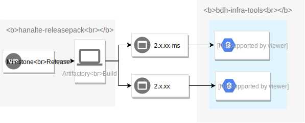
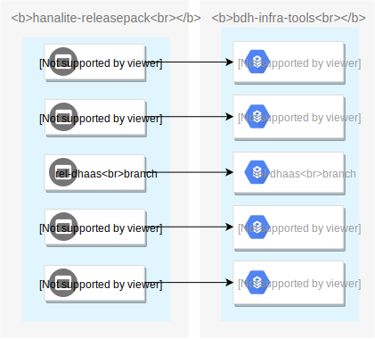

# CI Framework
*SAP DataHub CI framework* makes the build, deployment and validation of *Data Hub* easy with automated approaches, and enables the software quality of *Data Hub* to be monitored and tracked in all stages of development and release.
With *CI framework*, all component developers can get notified of product issues promptly and proceed to fix them.

- [CI Framework](#ci-framework)
  - [CI Landscape](#ci-landscape)
  - [CI Lifecycle](#ci-lifecycle)
    - [Work Flow](#work-flow)
    - [Test Plan Management](#test-plan-management)
    - [Test Execution](#test-execution)
    - [Test Monitoring & Analysis](#test-monitoring-amp-analysis)
    - [Test Report](#test-report)
    - [Bug Creation](#bug-creation)
  - [How to Contribute](#how-to-contribute)
  - [Release notes](#release-notes)

## CI Landscape

The following diagram shows the structure of CI combining various tools/services on different cloud platforms:

The following table shows the related tools/services in CI process:

Tool/Service Name | Description | Related URL
------------ | ------------- | ------------
GitHub | Codebase of related component in SAP DataHub product | [ref](https://github.wdf.sap.corp/bdh)
Gerrit | Codebase of SAP DataHub installer | [ref](https://git.wdf.sap.corp/plugins/gitiles/hanalite-releasepack)
InfraBox | Cloud native CI tool for running build/install/validation jobs | [ref](https://infrabox.datahub.only.sap/dashboard/#/project/hanalite-releasepack/)
Infrastructure Manager | Web tool for kubernetes life cycle management on different cloud platform(EKS, GKE, AKS, Gardener, DHaaS) | [ref](https://im.datahub.only.sap/)
EKS | Amazon Elastic Kubernetes Service | [ref](https://aws.amazon.com/eks/)
GKE | Google Kubernetes Engine | [ref](https://cloud.google.com/kubernetes-engine/)
AKS | Azure Kubernetes Service | [ref](https://azure.microsoft.com/en-in/services/kubernetes-service/)
Gardener | SAP Cloud Platform Kubernetes Clusters as a Service | [ref](https://github.wdf.sap.corp/pages/kubernetes/gardener/)
DHaaS | Service platform for creating DataHub as Service(Data Inteligence) | [ref](https://controlcenter.datahub.only.sap/)
Converged Cloud | SAP internal public cloud service | [ref](https://dashboard.eu-de-1.cloud.sap/monsoon3/home)

## CI Lifecycle

### Work Flow

The following chart shows the work flow of test management.

### Test Plan Management

Please refer to [this link](CI-Framework/How-to-Manage-Test-Plans.md) for details.

### Test Execution
- *Auto Test Execution*

  There are 3 types of validation tests which will start in different conditions, with different test plans on different platforms:

  - *Triggered*: milestone validation/push validation
  - *Scheduled*: dev nightly validaiton

Validation Type | Trigger Conditions | Test jobs | Platforms
--------------- | ------------------ | --------- | ---------
PUSH VALIDATION | Any code pushed onto hanalite-releasepack code base | Basic test suites | GKE and DHaaS
MILESTONE VALIDATION | Once there's a new milestone version generated | Full stable test suites | GKE, EKS, AKS, Gardener and DHaaS
DEV NIGHTLY VALIDATION | Every night on workdays | Unstable test suites | GKE, EKS, AKS, Gardener and DHaaS

[Upgrade Validation](CI-Framework/Upgrade-Validation.md) is included in PUSH VALIDATION and MILESTONE VALIDATION.

- *Code Relationships*

  *bdh-infra-tools* maintains the same code branches as *hanalite-releasepack*. In different validation processes, based on the milestone version or the code branch (master/stable), validation will choose the corresponding *bdh-infra-tools* code branch to make sure the test code matches the product's.

  In DataHub Milestone Valdiation, CI framework will follow this process to choose *bdh-infra-tools* code branch:

  

  In *hanalite-releasepack* Push Validation, the below chart illustrates the relationship between *hanalite-releasepack* and *bdh-infra-tools*:

  

  You can get more details [here](CI-Framework/Validation-Code-Relationships.md).

- *Guarantee of Test Execution*

    In order to make sure the tests will be executed correctly, we have added several pre-checks to the test.

    - Service Check

        Go over basic external service items before running each job to eliminate service issues.

    - Health Check

        Log into BDH as a real user to check the status of each component before running test jobs to make sure BDH is ready.

    Refer [here](CI-Framework/CI-Previous-Check.md) for more details.

- *Manually Test Execution*

  Apart from auto test execution, the framework also supports running customized tests on a customized *Data Hub* cluster: [User Manual](CI-Framework/ResourceDoc/odtem_user_manual/ODTEM-User-Manual.md).

### Test Monitoring & Analysis
**Roles**:
- *CI developer*
  > Responsibility: Make sure the tests are triggered properly and handle CI framework issues during test exectuation. Take actions to reduce the number of invalide bugs due to non-production issues.
  - [Suggest process](CI-Framework/ResourceDoc/TestMonitoring/CI_Developer.md)
- *Component developer*:
  > Responsibility: Fix bugs in either product or validation tests according to bug reports in time.
  - [Suggest process](CI-Framework/ResourceDoc/TestMonitoring/Component_developer.md)

### Test Report
Once a certain validation build finishes, different kinds of reports will be generated.

Report Type | Mode | Description
------------ | ------------- | ------------
[Q-Dashboard](https://dashboard.datahub.only.sap/index.jsp#home) | Real-time website | Show build/job/test trend and details.
Job report | Daily email | Send out daily validation results and failed job list to component owners.

[Test report introduction](DI-Quality-Dashboard/Q-Dashboard-Introduction.md)

**Roles**:
- *Component developer*:
  > Responsibility: Responsible for the quality of all test jobs and test cases under the components they manage, including success rate and stability
  - [Suggest process](CI-Framework/Test-Monitoring-and-Analysis-Guideline.md#component-developer)
- *QA manager*:
  > Responsibility: Responsible for the quality of all test jobs and test cases under the project they manage, and categorizing error root cause based on platforms and components if success rate is under the standard.
  - [Suggest process](CI-Framework/Test-Monitoring-and-Analysis-Guideline.md#qa-manager)

### Bug Creation
When a validation job fails, user needs to manually create or update the related based on JIRA ticket.

Please refer to [this link](DI-Quality-Dashboard/ResourceDoc/Bug-Creation-via-JIRA-Ticket.md) for more details.

## How to Contribute ##

[Quick Start Guide](How-To-Contribute.md)

## Release notes
**Latest release**: v0.12.0

- Support to run jobs in multi-groups on one platform.
- Add "Unanalyzed" status for the jobs and test cases on the Dashboard
- Show the services and healthy check results on infrabox dashboard
- Refactor the Dashboard framework, make it more lite and efficiency.
- Other bug fix.

[History Releases](https://github.wdf.sap.corp/bdh/bdh-infra-tools/releases)

# Contact
* [DL SAP data Hub Infra Xian](mailto:DL_5C32BEBF72260C02848FC740@global.corp.sap)
* [sap-data-hub.slack.com/#dh-push-validation](https://sap-data-hub.slack.com/messages/CAJ2AQY7N)
