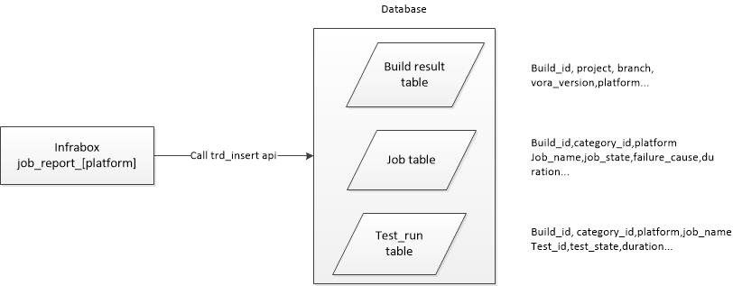
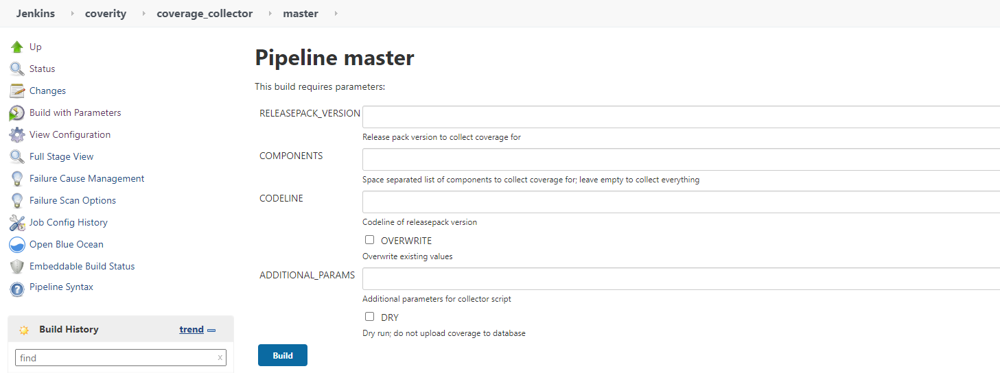
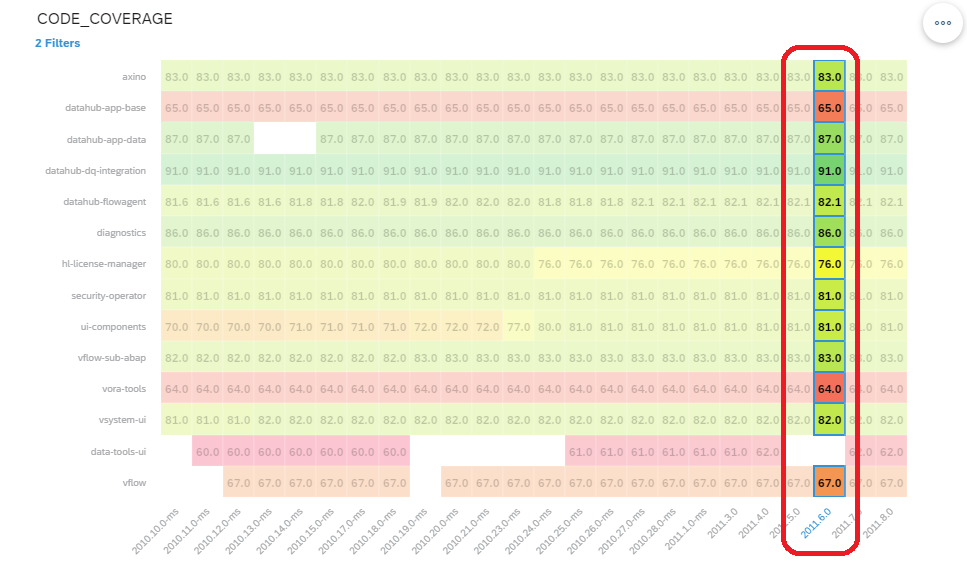
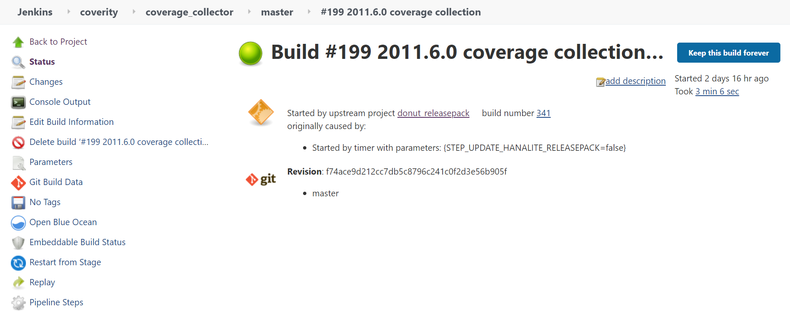
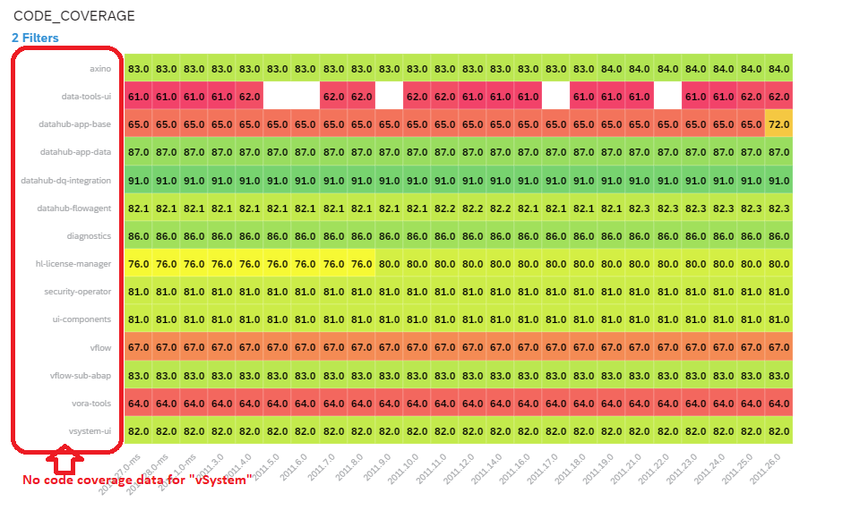
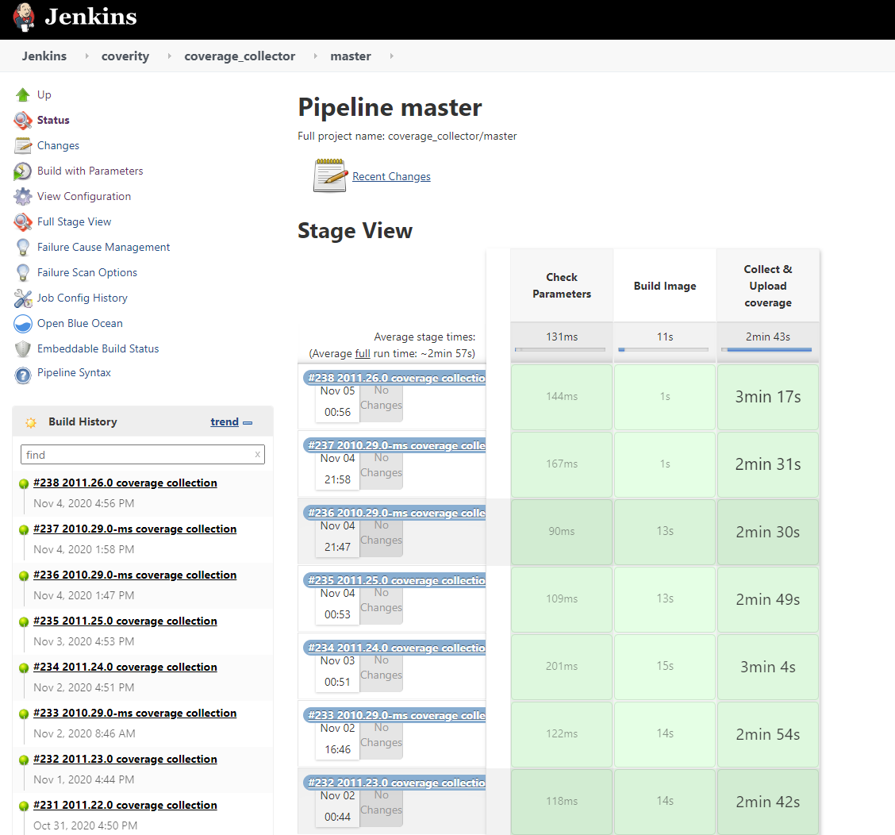
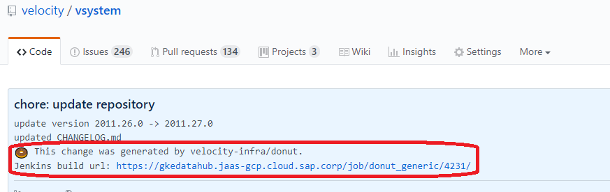
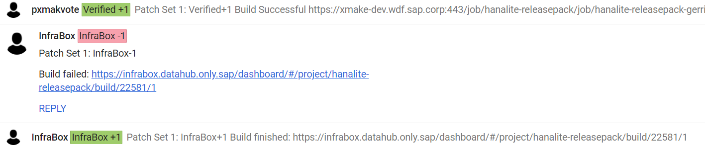
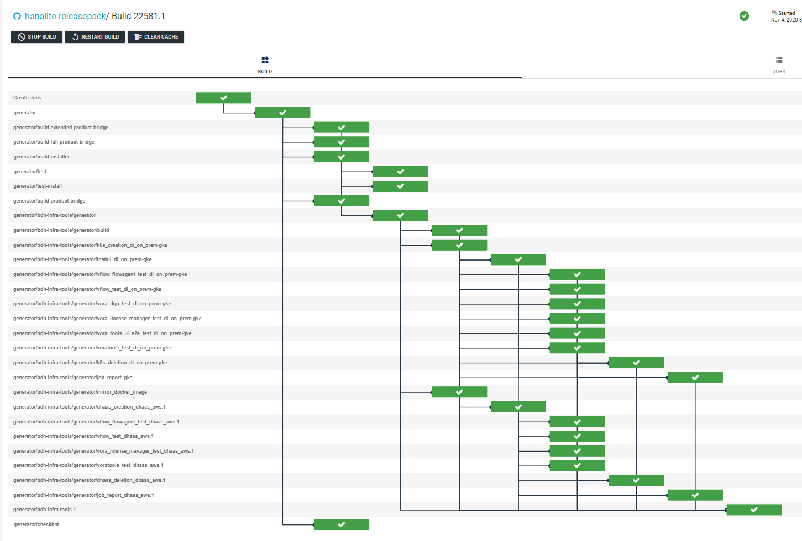

### Validation Report Dashboard

Currently, there are 2 kinds of report on [SAC system](https://hanalyticsreporting.us10.sapanalytics.cloud/sap/fpa/ui/tenants/c2a03/app.html#;view_id=story;storyId=6BA81AF8B24069A3FB43962FBD9C0F75).
1.Milestone validation test report
2.Code coverage report

This document shows how the report data inserted into database, how to generate the report and how to maintain the SAC report.

## Milestone validation test report
### How to generate Milestone build test report

Each milestone build will trigger an infrabox build to run the validation tests, and for each platform, there is a job_report in the end to collect the test result, and insert the result into dashboard database.



And there is a daily cronjob to call *sac/build/test* api to insert the report data into sac hana tables.

### How to check the test report

Here are 2 kinds of charts.
 - Test Case Pass Rate trend chart
 - Validation Real/Net Duration trend chart

You could check the different branch/deploy type by changing the filter.

And if you have questions about the SAC data, you could check the related [Validation Dashboard](https://dashboard.datahub.only.sap/index.jsp#/validationTestListbymilestone?branch=master&deployType=on_premise) and Infrabox Build.

The real duration means the time from k8s_creation to the last job_report job.

The net duration only contains the validation jobs.


## Code Coverage Report
### Where to get the SAP Data Intelligence (DI) Code Coverage Report

The SAP Data Intelligence (DI) Milestone Validation code coverage report is generated by the SAP Analytics Cloud (SAC).

Access via [DI Milestone Validation Code Coverage Report](https://hanalyticsreporting.us10.sapanalytics.cloud/sap/fpa/ui/app.html#;view_id=story;storyId=9BA81AF8B2428FA6B9A094F17D3742EA;forceOpenView=true)

This is the example of the code coverage reports web page in SAC.


### How to generate Code Coverage Result

The DI Code Coverage result can be triggered by two ways.

#### Python commands
```
$ git clone git@github.wdf.sap.corp:velocity-infra/coverage-collector.git
$ cd coverage-collector
$ python -m coverage_collector.collector -f components.json upload -l <branch> <hanalite-releasepack version>
```
#### Jenkins Job
[Jenkins Job Url](https://gkedatahub.jaas-gcp.cloud.sap.corp/view/coverity/job/coverage_collector/)



- RELEASEPACK_VERSION  - hanalite-releasepack version. e.g. 2010.10.0-ms
- COMPONENTS           - components list to do code coverage. e.g. data-tools-ui, vflow, ... (blank means all components)
- CODELINE             - GitHub codeline. e.g. master
- ADDITIONAL_PARAMS    - by default leave it blank. DRY means not update SAC report

Normally the code coverage will be triggered by bubbleup pipeline with the milestone validation test daily.

### How to find the original Code Coverage Results

If the user find that there is something missing or doubt the code coverage data correctness. 

He/She can check the original code coverage data.

Here is an example on the steps to check original code coverage data.



- In this report, there is no code coverage data for component **data-tools-ui**. Why?

- Here shows that, the component **data-tools-ui** has no code coverage data in version **2011.6.0**.

- Go to [Code Coverage Jenkins job](https://gkedatahub.jaas-gcp.cloud.sap.corp/view/coverity/job/coverage_collector/job/master/)


- Find the Jenkins build for the version **2011.6.0** from **Build History**.


- Click the build url for build detail.



- Click the **Console Output** for build log contents

|||
|---|---|
|||

- Click the url will nevigate to the component's code coverage infrabox job

### How to find why Code Coverage result missing for a component

Sometimes, the developer find that, there are some components which has NO code coverage result in the SAC dashboard.

e.g. In this SAC dashboard, there is NO code coverage data for component **vSystem**



**Why ? How to check ?**

Here we use **2011.26.0** as example.

Access [Code Coverage](https://gkedatahub.jaas-gcp.cloud.sap.corp/view/coverity/job/coverage_collector/job/master/) Jenkins job



Search the build **2011.26.0** from **Build History**


Note: 

Because of Jenkins will keep the build history log for a period of time, so you may can not find the build log too old.

Choose the build's **Console Output**


Retrieve the commit id for the component.


Copy the first 6 characters from commit id, e.g. **d7bd2b** 

Query the commit history for the component in GitHub




Click the Pipeline Jenkins build url, go to Pipeline Jenkins build UI


Click the **Console Output**, to find the Gerrit job url


Click the link, go to Gerrit dashboard, to find the Infrabox build url



Click the link, go to Infrabox build



Here we want to get job **generator/coverage-aggregator** for **vSystem** to retrieve the code coverage, but does not find it.

Finally, the root cause of missing code coverage data is found.

## Reference
[Validation Dashboard Git Project Overview](https://github.wdf.sap.corp/bdh/dh-validation-dashboard/blob/master/README.md)

[Validation Dashboard Introduction](DI-Quality-Dashboard/Q-Dashboard-Introduction.md)

[Validation Dashboard Database Introduction](DI-Quality-Dashboard/Q-Dashboard-Database-Introduction.md)

[How to contribute code](How-To-Contribute.md#quality-dashboard)