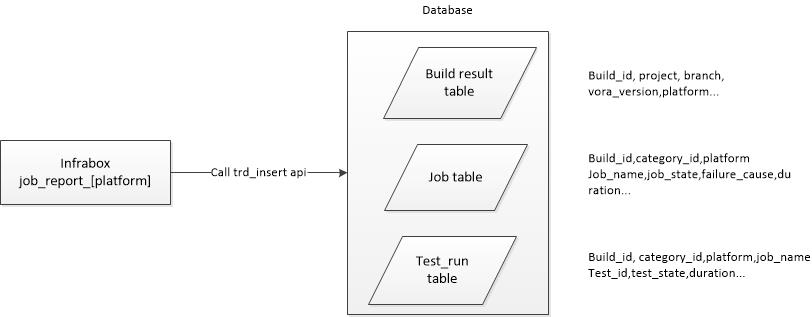

# Q Dashboard Database Introduction

## Workflow

Infrabox job "job_report_{platform}" call trd/insert restApi to insert the build/job/test run data into dashboard database.

## DB structure
Used Postgresql.
### Tables
Table Name | Description 
------------ | ------------
catagory | Record the use_for/branch/project information for different validation type, and the catagory_id will be used in job and test_run tables. 
result_milestone_validation   result_push_validation   result_upgrade_validation   result_nightly_debug_build | Record the real-time information for a validation build. The request data is from infrabox job report.
job | Record the real-time information for a validation job
job_info | Record the static job information(job owner, job repository) for a validation job, and the relationship between component and job.
test_run | Record the real-time information for test in validation job
test | Record the test suite, test name and test owner information for a test
component_group_info | Record the component group and component relationship
component_info | Record the component information, for example, component name, component owner.

### Views
View Name | Description 
------------ | ------------
v_single_milestone_validation   v_single_push_validation   v_single_upgrade_validation   v_single_nightly_debug_validation | Combine all the platforms data into one row for original result table.

### Functions
Function Name | In | Out | Description 
------------ | ------------ | ------------ | ------------
search_validation_latest_result | result_view_name, query_clause | build information | Search the latest result for different validation type

## DB auditing.[todo]

_Requested by Eric. Need further investigation._

## DB maintainance

### DB backup

There is a kubernetes cronjob to backup the whole database data everyday. And testDB is a copy of production database.

### Test and review

- Always use testDB for feature development and debugging
- If there is a feature requested to change the database, test the sql on testDB and send out the sql change for review.
