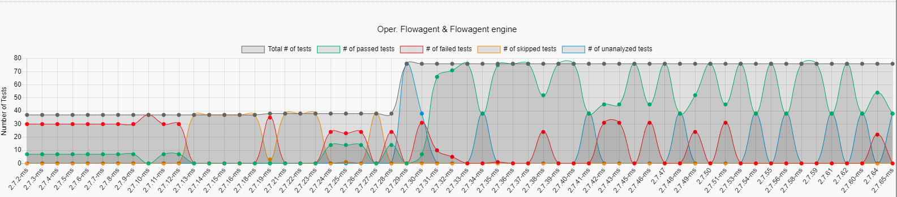
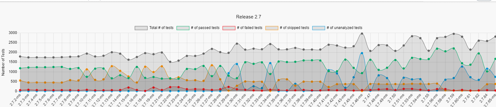

# Q Dashboard Introduction

Here are two different reports we are offering to monitor the test result.

- [SAP Data Hub Validation Dashboard](#sap-data-hub-validation-dashboard)
  - [1. Dashboard Overview](#1-dashboard-overview)
  - [2. Role-related Feature Introduction](#2-role-related-feature-introduction)
- [Daily Reports](#daily-reports)
  

## SAP Data Hub Validation Dashboard

### 1. Dashboard Overview
Entry - [SAP Data Hub Validation Dashboard](https://dashboard.datahub.only.sap/index.jsp#/home)

This dashboard is mainly for real-time reflection of test case results in different validation builds. It consists of 7 blocks:

_Block1_ - Latest Test Status: Display the latest test running results for each validation.

_Block2_ - Milestone Validation Tests: Display all historical test results and trend chart for milestone validation

_Block3_ - Developer Nightly Tests: Display all historical test results and trend chart for Developer Nightly validation

_Block4_ - Upgrade Tests: Display all historical test results and trend chart for upgrade validation

_Block5_ - Backup/Restore Tests: Display all historical test results and trend chart for backup/restore validation

_Block6_ - Push Validation Tests: Display all historical test results and trend chart for push validation

_Block7_ - Component Job Matrix: Show the job coverage on platforms, versions and deploy types

_Icon1_ - Help button: Click to show the help message for each page

_Icon2_ - Document button: Click to show the backend api doc

_Icon3_ - User Preferences: Click to change the display theme.

### 2. Role-related Feature Introduction
**2.1 For CI developers:**

(1) Job and test cases details could be checked by clicking on items in _Block1_.

- There are 5 layers in test case detail page. Component Group->Component->Infrabox Job->Test Suite->Test Case
- For each failed jobs, CI developers should input the bug number or failure comment by clicking the **_Edit button_**
  - Following the guide [Bug Creation via JIRA](DI-Quality-Dashboard/ResourceDoc/Bug-Creation-via-JIRA-Ticket.md)

 
(2) The job trend could be checked by clicking on item “By job” in _Block2, Block3, Block4, Block5_

**2.2 For Component Owner:**

(1) The trend of test cases summarized by component group could be checked by clicking on item `By Component Groups` in _Block2, Block3, Block6_

 
(2) The trend of test cases summarized by component could be checked by clicking on item `By Component` in _Block2, Block3, Block6_

**2.3 For QA manager:**

(1) The trend of test cases summarized by release versions could be checked by clicking on item `Overview` in _Block2, Block3, Block4, Block5_

(2) The build list summarized by platform could be checked by clicking on item `By Platforms` in _Block2, Block3, Block4, Block5, Block6_

## Daily Reports
CI framework sends report E-mail of failed job summary to all related roles every day around 18:00(UTC+8).
- It contains the validation builds which ended between yesterday 17:30(UTC+8) and today 17:30(UTC+8)
- If job fails, job owner should report bug to JIRA, and add the bug number or failure comment via `Edit` button.
- In this report, user could check the failure reason by linking to Infrabox or JIRA bug.

