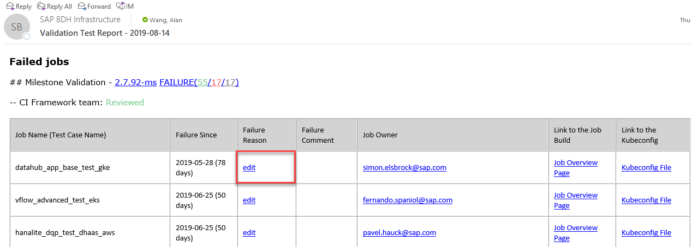
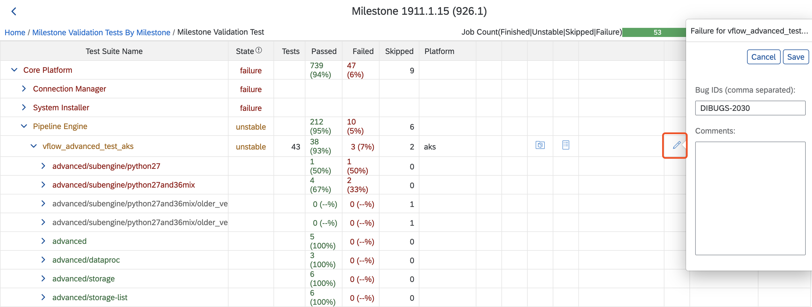
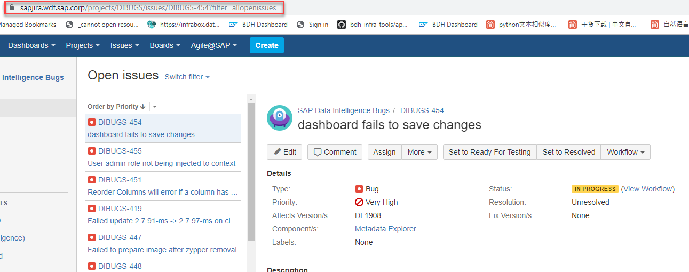

# Bug Creation via JIRA Ticket

In order to harmonize and optimize bug tracking for Data Intelligence / Data Hub, we decided to consolidate the bug tracking based on Jira and using the standard integrations with Customer Support (BCP) and Backlog Management (Jira).

There are several steps, which could help you understand how to update and maintain the bug.

## 1. Entrance

There are 2 ways to maintain the bugs.
1. An E-mail with title "Validation Test Report" will be sent everyday. 
   - There is an `edit` button under failed jobs. Click this button to input the bug number and failure comments.
   

1.  Maintain the bugs in validation dashboard directly
   - Click "edit" button on validation test dashboard [test case detail page](https://dashboard.datahub.only.sap/index.jsp#/milestonetest/1911.1.15/?deployType=on_premise)
   

    - For production issues
      - Input the JIRA ticket number in  failure-reason.

    - For infrastructure issues
      - Add a tag, like INFRASTRUCTURE_ISSUE to the failure comment.

## 2. Create JIRA ticket under DIBUGS project

[Project DIBUSG](https://sapjira.wdf.sap.corp/projects/DIBUGS/issues) is the place which could be used to create bugs.

Please _make sure_ to **create a bug only if the issue is production issue**.

And please also be noticed of,

   - All bugs with associated limitations or customer tickets in Data Hub Bugzilla are mirrored to DIBUGS Jira.

   - All bugs from MLDSP Jira are moved to DIBUGS Jira.

   - All existing bugs (including bugs with limitations and customer tickets) will be maintained in Bugzilla until they are closed. The proxy in Jira is used for official reporting and adjacent processes (limitation handling, BCP integration).

   - It won’t be possible to create new bugs in Bugzilla and MLDSP Jira anymore after CW34.

   - Creation of Limitations (i.e. Roadmap Items) and their assignment to Bugs is still in progress

