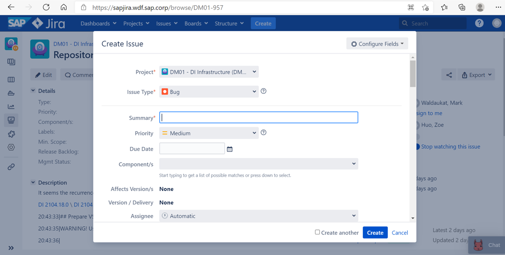

# Milestone related for QIT

## Get info from Slach channels

Please join the ==Data Intelligence Slack workplace== at first.

### Related Stack channels:

​	di-milestones,di-milestone-validation,di-backup-restore-validation,di-upgrade-validation


Please check whether the ==corresponding version== is built on time!

## Check build details in infrabox

### Infrabox

https://infrabox.datahub.only.sap/dashboard/#/

### Three main aspects

#### milestone-validation

https://infrabox.datahub.only.sap/dashboard/#/project/milestone-validation

#### milestone-validation-backup

https://infrabox.datahub.only.sap/dashboard/#/project/milestone_validation_backup

#### upgrade-validation

https://infrabox.datahub.only.sap/dashboard/#/project/upgrade-validation


### Branch priority

Build branches are divided into master and other release branches. 

==The importance of release branch is higher== than that of master, and it takes precedence in reporting

## A specific build for a master branch example

### Details:

branch: master 

version:2105.1.0

milestone: [on premise_2105.1.0](https://infrabox.datahub.only.sap/dashboard/#/project/milestone-validation/build/2361/1)  / [on cloud_2105.1.0](https://infrabox.datahub.only.sap/dashboard/#/project/milestone-validation/build/2362/1)

backup: [backup_2105.1.0](https://infrabox.datahub.only.sap/dashboard/#/project/milestone_validation_backup/build/889/1) 

upgrade: [upgrade_2105.1.0](https://infrabox.datahub.only.sap/dashboard/#/project/upgrade-validation/build/2901/1)


### Two deployment methods

#### On cloud

==More important than on premise==

There are three platforms for deployment: GKE,AKS,EKS

#### On premise


### How to check issue

#### Check the creation and install jobs at first

==All platforms should be checked!==

If there is a failure or error, try to check the reason from the ==CONSOLE OUTPUT==. 


If install fails, check the slcb.log in the ==ALL ARCHIVE==


### Check whether the issue should be taken by QIT

For other jobs, if they have not  run into the internal tests  yet but report an error, please check whether it is our problem. 

If they run into their own internal tests and report same errors for successive versions, we should report these bugs to the corresponding component owner if these problems are not fixed.

Usually take ==start docker daemon== as the dividing line


However, ==it's very important to analysis the specific issues for specific conditions==

### Check whether the job report works well with DI dashboard

#### DI dashboard

https://dashboard.datahub.only.sap/index.jsp#home


#### Job report in Infrabox


In a normal process, each platform job runs first, and then the first ==failed and killed== jobs will rerun. Therefore, under normal circumstances, the job report will insert the data of the first time,.After the rerun the results of these two times will be combined.

Check if there is any ==great difference== between ====the build test count of infra box== and the ==dashboard==. 

If so, analyze the details

## Analysis for release branch

Usually, there is only one deploy type for a release branch, so its analysis method is similar  with that for master branch.

However, it has a ==higher priority== to be solved.

### on premise

rel-2.7  / rel-3.0  / rel-3.1

### on cloud

rel-2013  / rel-2103  / rel-2104 and so on

## CI dashboard for tracking details

https://ci-dashboard.datahub.only.sap/index.html#/PipelineListPage


 

## If GKE install failed on one platform the first time, rerun won’t start 

There is some difference between **rerun** and **restart**

### rerun

**rerun** means that when the first runtime is done，the jobs with **failure** and **killed** status will run one more time

These **rerun** job will have a suffix of “==.1==”：[link](https://infrabox.datahub.only.sap/dashboard/#/project/milestone-validation/build/2365/1)


### restart

**restart** means that when a job fail when create or install on a platform，the fault cluster will be deleted.

It will restart from the creation.

Therefore, all jobs will have a suffix of “==.1==”,and the **rerun** jobs will have a suffix of “==.2==” at the same time：[link](https://infrabox.datahub.only.sap/dashboard/#/project/milestone-validation/build/2363/2)


### GKE

However, the situation may be ==different on GKE== cause its creation and install is executed by ==four processes==.

So if there is any failed creation or install in these four process(which also means retsart jobs existed),no **rerun** jobs will be executed on GKE. E.g[2104.20.0](https://infrabox.datahub.only.sap/dashboard/#/project/milestone-validation/build/2349/1)


## manually trigger job_report

If there is ant problems with the corresponding data on the dashboard，job report is necessary to be inserted manually.

### Get job report of corresponding platform：

get file **request_json_data.json** in ==Archive==


### Using API

API:  POST https://api.dashboard.datahub.only.sap:30711/api/v1/trd/insert

Paste the component of **request_json_data.json** in postman and post it using the API above.

Please make sure your selections are same with the following picture.

The processing will take a few minute and you will get a "created" response if succeed.  

 


## IM check and keep cluster

Sometimes it's necessary to check the cluster info or keep the cluster when some situations like install failure or others occur. 

### Check cluster

Search the cluster_name on a platform in the **Platform** 


Then search this cluster in [IM](https://im.datahub.only.sap/index.jsp#home)


For **owner** selection please ==choose== **all** rather than **my list**. Then search with the cluster_name.


Kindly asking ==IM team== for help if you can't see any info because of your ==limited authority==  ! 


### Keep cluster

The cluster ==will be deleted== after being preserved for a period of time.


If you want to preserve the env of cluster,==Update Cluster Tag== to “CI_VALIDATION_INVESTIGATION”，then ==Extend Expiration Time== as you wish.

#### For the information needed to be provided for the preservation ：

```markdown
Summary information

The environment of this problem can be recurrented  in EKS DI version 2013.31.0, the expiration date is to 2021-01-07 20:03:24

admin.conf

The download of admin.conf
：https://infrabox.datahub.only.sap/api/v1/projects/d32dafb5-2a57-4b9d-abef-6a230322c2df/jobs/4ce4316a-30aa-4d91-8672-8cb6ebf94c66/archive/download?filename=archive/admin.conf&view=false（k8s_creation）

The url ofenv.sh :  (install)

Info should be like as follows:

content:{

  "cluster_name": "sap-bdh-infra-20210428-044918333",

  "status": "200",

  "url": "https://infrabox.datahub.only.sap/dashboard/#/project/cluster-deployment/build/99080/1"

}

 ** 

RELEASEPACK_VERSION=2013.31.0

VORA_USERNAME="system"

VORA_PASSWORD="Sapvora123@"

VSYSTEM_ENDPOINT="https://sap-bdh-infra-20210428-044918333-gke.infra.datahub.sapcloud.io:443"
```

 

## create DM-01 JIRA bug

example：[[DM01-957 /] Repository already exists exception on vsystem_integration_test - SAPJIRA](https://sapjira.wdf.sap.corp/browse/DM01-957)

### To create：

#### Mandatory:

Summary(issue title)

Component(who should be informed for this issue)

Assignee（if not sure, just select auto, stake holders will handle this）

Priority（select Very High， High， Medium or Low due to specific situations and conditions）

#### Others:

Add according to the specific situations,like Lables.



 

##  History issues traceback 

Select ==**By Milestone**== in ==**Milestone Validation Tests**==


Select corresponding ==Version==


Select corresponding ==Bug==


