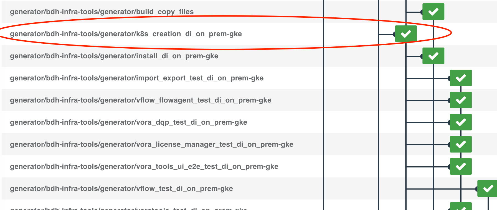
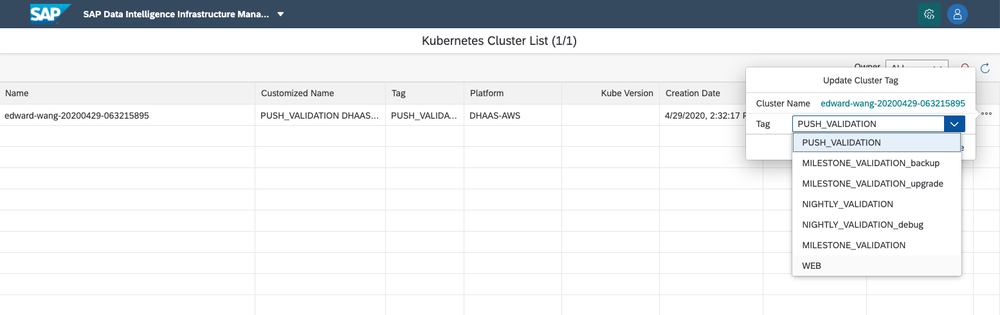

# Reserve Cluster for debugging in hanalite-releasepack push validation

## Background

In [bubble-up](https://github.wdf.sap.corp/pages/velocity-infra/documentation/production/#bubbleup) process, some component updates will be blocked in hanalite-releasepack push validation, when run some tests with Kubernetes clusters on public cloud. Usually in push validation, after testing, the cluster will be deleted automatically. If there are some issues in testing, it's hard to just debug via logs.

Here's a guide for the developer who wants to reserve the push validation clusters and debug.

## Prerequisite

1. InfraBox [hanalite-releasepack](https://infrabox.datahub.only.sap/dashboard/#/project/hanalite-releasepack) project collaborator role.

  If you don't have the role, you can contact [Edward Wang](mailto:edward.wang@sap.com), [Max Zhang](mailto:max.zhang@sap.com), or [Tugba Bodrumlu](mailto:tugba.bodrumlu@sap.com) to assign the role via InfraBox. Also you can just send your request on slack channel `#dh-push-validation`.

2. [Infrastructure Manager](https://im.datahub.only.sap/index.jsp#home) admin permission.

  If you don't have the permission, please find the administrators in your location/org by searching `Admin` role in [Infrastructure Manager User List](https://im.datahub.only.sap/index.jsp#/UserManagement), to help you do the operation of [Reserve cluster in Infrastructure Manageer](#reserve-cluster-in-infrastructure-manageer). If you don't know how could be contact, you can contact [Gao-zhi Wang](mailto:gao-zhi.wang@sap.com), [Sarah Guo](mailto:sarah.guo01@sap.com). Or send your request on slack channel `#infra-manager`.

## Steps

### Restart cluster creation and stop the deletion job

1. Find the InfraBox job from Gerrit link, for example in this [change](https://git.wdf.sap.corp/c/hanalite-releasepack/+/4709930), click the link, and find InfraBox URL the latest `InfraBox` comments:

  

2. Open the InfraBox job URL, find the validation chain of the failed jobs:

  

3. Click the start job of the failed validation chain(job `k8s_creation_*` or `dhaas_creation_dhaas_aws`), and click restart job.

  Find cluster start job:

  
 
  
  
  Click job and click `Restart Job`:

  
  
  Once the creation job is restarted, you will see all the jobs in this chain are restarted:
  
  
  
  Find the cluster deletion job(`dhaas_deletion_*` or `k8s_deletion_*`), and stop the job:
  
  
  
  
  
### Reserve cluster in Infrastructure Manageer

  Even the creation job is restarted and deletion job is stopped, cluster will still be deleted after 6 hours after created. Because the cluster tag on Infrastructure Manager is PUSH VALDIATION. Here're the steps to change the cluster tag on IM and extend the expired time.
  
1. Get cluster name. In creation job, check the creation job logs to get the cluster name, in this case it's edward-wang-20200429-063215895:

  
  
2. On Infrastructure Manager(make sure if you have the admin permission), select [Landscape -> Kubernetes Clusters](https://im.datahub.only.sap/index.jsp#/KubernetesClusters). Choose `Owner` dropdown list to `ALL`. Search the cluster with cluster name:

  
  
3. Click the right button. Choose `Update Cluster Tag`. Change current tag from `PUSH VALIDATION` to `WEB`:

  

4. Click `Extend Cluster LifeTime` for 1 day:

  
  
Now the cluster is kept for developers for debugging.