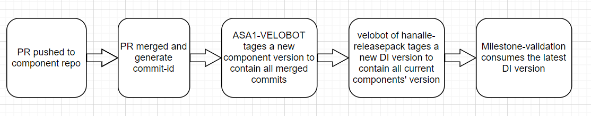
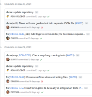
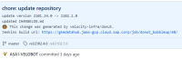
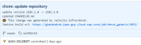

# The lifecycle of a component code change
This flow chart shows the lifecycle of a component code change  
  

## How to consume changes in components repository  
- Developer pushes a PR to component repo.
- The PR triggers review and some checks(Unit tests, lints, etc)    
- The PR can be merged, after the PR is reviewed and all checks pass.  
- commit-id will be generated for each merged PR. and all commit-ids can be shown in this web:
```
https://github.wdf.sap.corp/<repo>/commits/<branch_name> 
```

- The technical user 'ASA1-VELOBOT' will update repository with the steps below:  
1) bump up new version to contain all merged commits, update the component version file cfg/VERSION and generate new tag with this version.  
2) update other component versions that the current repository depends on.  

- Example of how developer check the PR in which component version:  
The vsystem commits list has 2 'ASA1-VELOBOT update repository' PRs:  
  
One in 2021/1/29 (update vsystem component version to 2102.1.0)   
  
the other in 2021/1/30 (update vsystem component version to 2102.2.0)  
  

These 2 PRs "fix(DIBUGS-6652):xxxx" and "fix(DIBUGS-6352): xxxx" are merged into Vsystem component version 2102.1.0 in 2021/1/29.  
And these 3 PRs "chore(vrep, BDH-9713): xxxx", "fix(DIBUGS-6689, pki): xxxx" and "chore(vctl): xxxx" are merged into Vsystem 2102.2.0 in 2021/1/30.  

## How to find the DI version by giving bug
- Navigate to the DI [hanalie-releasepack](https://git.wdf.sap.corp/plugins/gitiles/hanalite-releasepack/) to check the DI version and the corresponding component version.  
- The technical user 'velobot' will tag a new DI version to contain all current components' version 
- Click the correct branch/tag, then click the pom.xml file.   
```
# this is the DI version
<version>xxxx</version>
# this is the component version
<hldep.the_component_name.version>yyyy</hldep.the_component_name.version>   
```

Take DI master version [2102.4.0](https://git.wdf.sap.corp/plugins/gitiles/hanalite-releasepack/+/refs/heads/master/pom.xml) for example:
```
  <groupId>com.sap.datahub</groupId>
  <artifactId>SAPDataHub</artifactId>
  <version>2102.4.0</version>
  ......
    <hldep.hl-vsystem.version>2102.1.0</hldep.hl-vsystem.version>
  ......
```
Vsystem version is 2102.1.0, means the PRs which merged into Vsystem 2102.1.0 are merged into DI 2102.4.0. But the PRs in the Vsystem 2102.2.0 are *not* merged into DI 2102.4.0.


## How to check if the change be included in a milestone release

- Navigate to the [milestone-validation](https://infrabox.datahub.only.sap/dashboard/#/project/milestone-validation/) web site, click the latest build number of the correct Branch.
- You can click any job of this build. such as the first job **Create Jobs**
- Then click the **CONSOLE OUTPUT** button, and search these environments **CODELINE, DEPLOY_TYPE, RELEASEPACK_VERSION** in the console.  
**CODELINE** value means branch name, such as master, rel-3.1, rel-2013 and so on,  
**DEPLOY_TYPE** value should be one of [on_premise, on_cloud], on_premise means: GKE, EKS, AKS platform.  on_cloud means DHAAS_AWS platform.   
**RELEASEPACK_VERSION** value means the DI version, which is the same with the version value of [hanalie-releasepack](https://git.wdf.sap.corp/plugins/gitiles/hanalite-releasepack/+/refs/heads/master/pom.xml)  
such as:
```
CODELINE=master             
DEPLOY_TYPE=on_cloud
RELEASEPACK_VERSION=2102.4.0
```
This milestone-validation infrabox build verifies the DI which branch is **master**, version is **2102.4.0**, and platform is **DHAAS_AWS**. All PRs merged in this branch and version are verifed in DHAAS_AWS.


