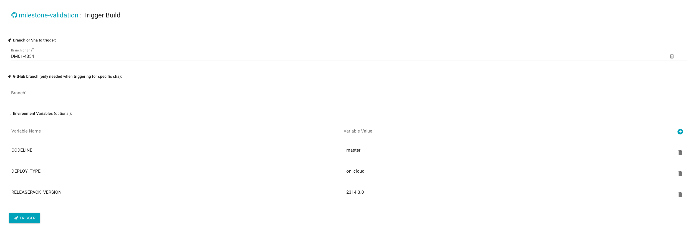

# Upgrade K8S Version
## Upgrade k8s version for milestone validation
### Update k8s version on different platforms
- For on-cloud release validation e.g. on DHAAS, update code in [milestone validation](https://github.wdf.sap.corp/bdh/milestone-validation/blob/main/database/temp_details/dhaas_aws/common/common.json#L28)
- For on-premise release validation e.g. on GKE, AKS, EKS, update version in [create_k8s.py](https://github.wdf.sap.corp/bdh/bdh-infra-tools/blob/main/hera/ci/hanalite-releasepack/infrabox/k8s_creation/create_k8s.py), json env_gke_model, env_aks_model, env_eks_model
### Test
#### Test on your branch
- For on-cloud release validation, Trigger [milestone validation](https://infrabox.datahub.only.sap/dashboard/#/project/milestone-validation/trigger) to test, params example as bellow:
  ```
  Branch or Sha to trigger: DM01-4354 <your branch>
  
  CODELINE=master <base branch>
  DEPLOY_TYPE=on_cloud
  RELEASEPACK_VERSION=2314.3.0
  ```
  
- For on-premise release validation, update and push changed code in [create_k8s.py](https://github.wdf.sap.corp/bdh/bdh-infra-tools/blob/main/hera/ci/hanalite-releasepack/infrabox/k8s_creation/create_k8s.py), then update your branch in [.gitmodules](https://github.wdf.sap.corp/bdh/milestone-validation/blob/main/.gitmodules#L5), and update submodules and push.
eg:
  > cat .gitmodules
  ```
  [submodule "bdh-infra-tools"]
  path = bdh-infra-tools
  url = git@github.wdf.sap.corp:bdh/bdh-infra-tools.git
  branch = DM01-4354 <your branch in bdh-infra-tools>
  ``` 
  > git submodule update --remote -- bdh-infra-tools

  > git commit -m "chore: test upgrade k8s version"

  > git push

  Trigger [milestone validation](https://infrabox.datahub.only.sap/dashboard/#/project/milestone-validation/trigger) to test, params example as bellow:
  ```
  Branch or Sha to trigger: DM01-4354-3.2 <your branch in milestone>
  
  CODELINE=rel-3.2 <base branch>
  DEPLOY_TYPE=on_premise
  RELEASEPACK_VERSION=3.2.159
  
  MS_PLATFORM=['GKE']  --optional
  ```
#### Test after code merged
- First way, trigger [jenkins job](https://gkedatahub.jaas-gcp.cloud.sap.corp/view/rel-3.2/job/donut_releasepack_rel-3.2/) to test
- Second way, trigger [milestone validation](https://infrabox.datahub.only.sap/dashboard/#/project/milestone-validation/trigger) to test, only need to change [ Branch or Sha to trigger] param to official rel branch

Note: For on-premise release validation, we have schedule job to update submodule [bdh-infra-tools] in [milestone validation repo](https://github.wdf.sap.corp/bdh/milestone-validation/) every day at 9am. 
If you want test it immediately, you should update submodule bdh-infra-tools] manually, to make sure the chang is working.
  > git submodule update --remote -- bdh-infra-tools
## Upgrade k8s version for backup & restore validation
- For on-cloud release validation e.g. on DHAAS, update version in [di_backup_milestone_test_on_cloud.json](https://github.wdf.sap.corp/bdh/bdh-infra-tools/blob/main/hera/di_backup_milestone_test_on_cloud.json#L40), json dhaas_creation_dhaas_aws
- For on-premise release validation e.g. on GKE, AKS, EKS, same as on milestone validation, update version in [create_k8s.py](https://github.wdf.sap.corp/bdh/bdh-infra-tools/blob/main/hera/ci/hanalite-releasepack/infrabox/k8s_creation/create_k8s.py), json env_gke_model, env_aks_model, env_eks_model
## Upgrade k8s version for upgrade validation
- Update base k8s version in [create_k8s.py](https://github.wdf.sap.corp/bdh/bdh-infra-tools/blob/main/hera/ci/hanalite-releasepack/infrabox/k8s_creation/create_k8s.py), function update_env_when_upgrade
- Update target k8s version under folder [temp_details](https://github.wdf.sap.corp/bdh/bdh-infra-tools/blob/main/hera/ci/hanalite-releasepack/infrabox/multiple_step_upgrade/database/temp_details), in common.json for each platform
## Upgrade k8s version for push validation
- For on-cloud release validation e.g. on DHAAS, update code in [push_val_infrabox.json](https://git.wdf.sap.corp/plugins/gitiles/hanalite-releasepack/+/refs/heads/master/TestCycleConfiguration/push_val_infrabox.json#59), json dhaas_creation_dhaas_aws
- For on-premise release validation e.g. on GKE, AKS, EKS, same as on milestone validation, update version in [create_k8s.py](https://github.wdf.sap.corp/bdh/bdh-infra-tools/blob/main/hera/ci/hanalite-releasepack/infrabox/k8s_creation/create_k8s.py), json env_gke_model, env_aks_model, env_eks_model, 
  then update submodule [bdh-infra-tools] in [hanalite-releasepack](https://git.wdf.sap.corp/plugins/gitiles/hanalite-releasepack/) on specific branch

